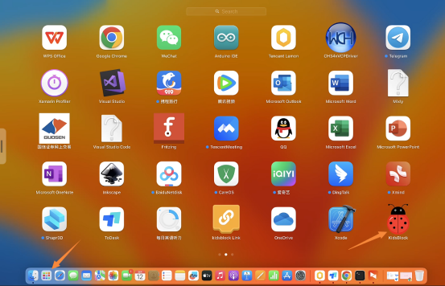

# 3. Install Kidsblock Software---MacOS
Note: We take the MacOS system as an example.

1. Download link：`https://www.kidsblock.cn/Down/KidsBlock-MACOS.dmg` ，as shown below:

2. Double-click KidsBlock icon，then drag **KidsBlock** to the Applications folder.

3. It’s installing the kidsblock program on your computer.

4. After the installation is finished, you will view the KidsBlock icon.

5. Click KidsBlock software icon to start the software, it shows that it can't be opened, because the default Apple computer only allows the installation of software in the App Store, other software is not allowed to install. Thus we need to modify the computer settings to start the software.

6. Open your computer's settings interface, click Privacy & Security, switch the security option to "App Store and identified developers", then click "Open Anyway".

7. Tap Open.

8. Open the software.

9. It is the software interface.

