# 4. How to use KidsBlock
（We will demonstrate how to use KidsBlock on Windows system（MacOS can refer to it）

1.Interface：
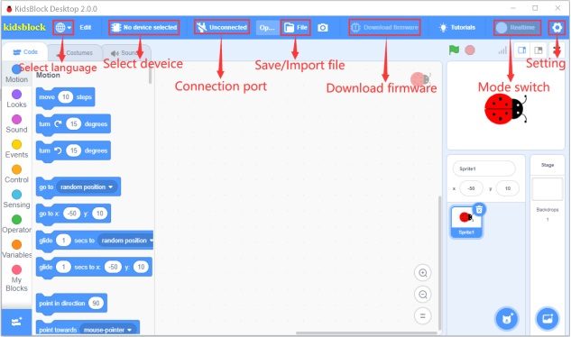

2.Click to switch to different languages.
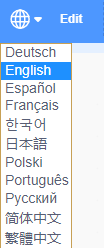

3.Tap to select **Install driver**.（Note: If the driver is not installed, as shown below:
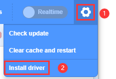

A.Click **Next** at the **Device Driver Installation Wizard page**.

B.After a while, click **Finish**

C.Then click **Next**

D.And click **Finish**

E.Then click **Allow** and **Install**

F.After a while，click **Finish**

G.Select **Extract**

H.Click **Next**

I.Next, click **I accept this agreement** and **Next**

J.Click **Finish**

K.After a while, click **INSTALL**
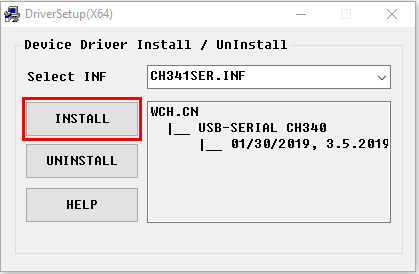

O.After a few seconds, when the driver is installed, just click **OK**
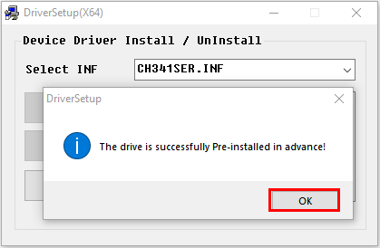

4.Click to enter the main page, and select the control board needed. In this project, we select the kidsUno mainboard and click **Connect**, then it is connected.
Click Go to Editor to return the code editor. 
Icon will change into  and  will change into . This means the kidsUno mainboard and ports（COM）are connected.        
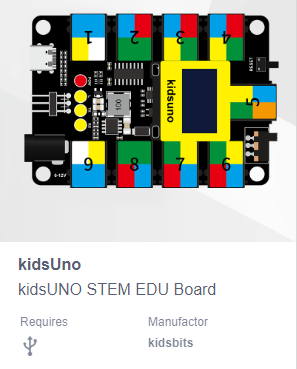
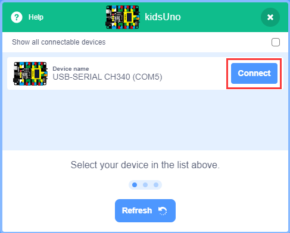
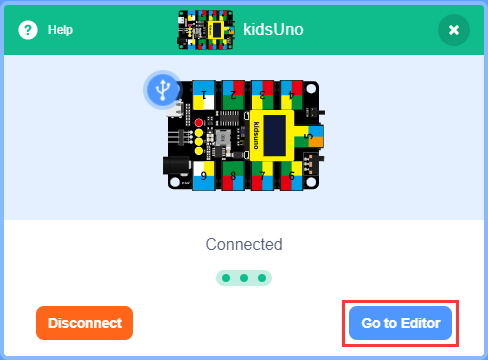
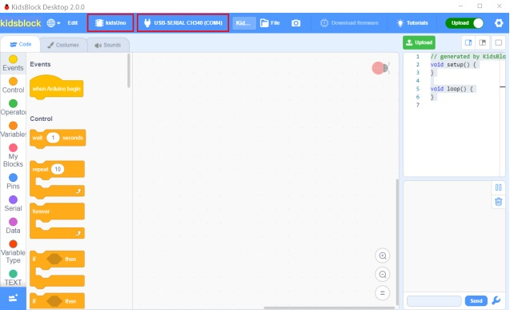

5.If the kidsUno mainboard is connected , but icon doesn’t change into . You need to click to connect the COM port.
Click. Then you will find a page pop up, showing Connected.

To disconnect the port, just click and Disconnect.
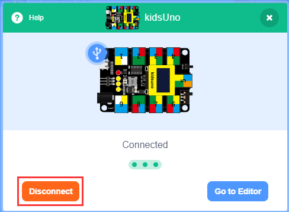

6.The kidsUno mainboard and the COM port are connected, then  automatically switches to .
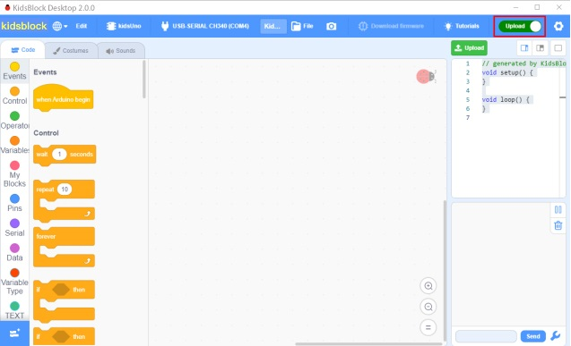
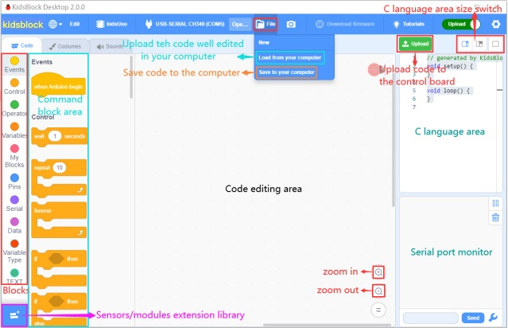

Note：If you want to update libraries of KidsBlock, click then Clear cache and restart.
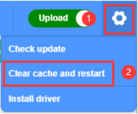

7.stands for extension libraries of sensors and modules. 
Click to enter the page of extension libraries, click a sensor or module to add. For example, if click the **passive buzzer** module,**Not loaded** will change into **Loaded**. Then the passive buzzer is added.
 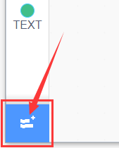
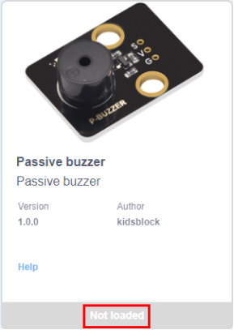
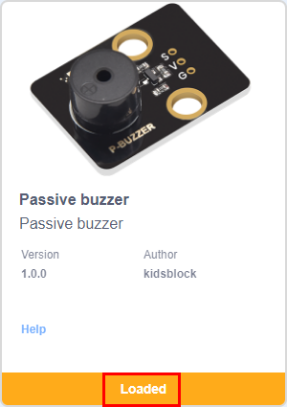

Click to return to the code editor. Then you can view the passive buzzer in the blocks area.
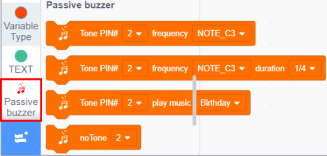
If you want to delete the **passive buzzer**, click to select the passive buzzer. Then **Loaded** will change into **Not loaded**.
Then the passive buzzer is deleted.

The way of deleting other sensors or modules is as same as the passive buzzer.

8.How to open SB3 type files：
The first method：Double-click SB3 type files to open them.
For instance, open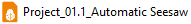, then we need to double-click it.

The second method: Open Kidsblock，click **file** and **Load from your computer**，then select the SB3 type file on the computer.（for example）
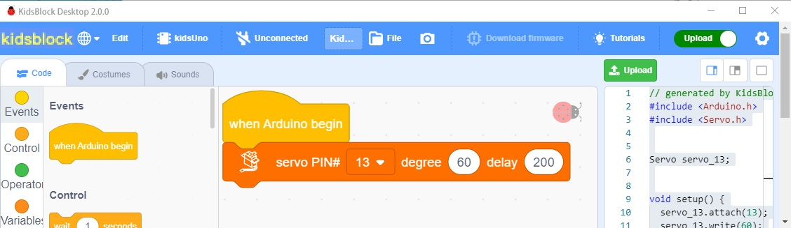
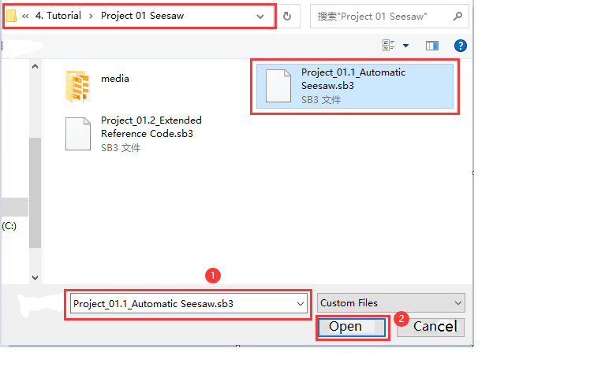

Note：Please refer to the following link for MacOS：
https://kidsblocksite.readthedocs.io/en/latest/

