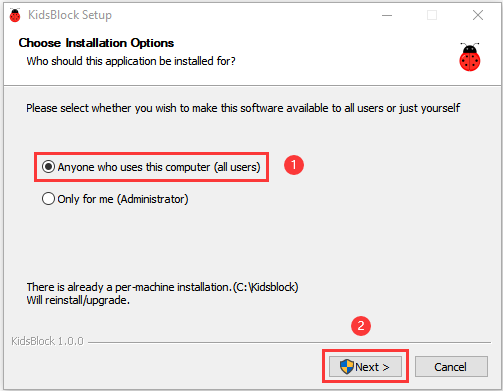
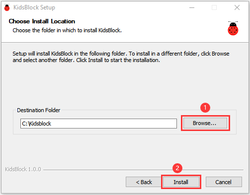
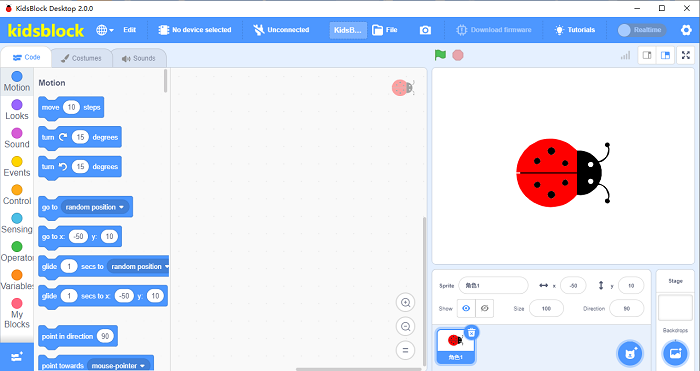
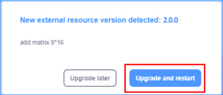
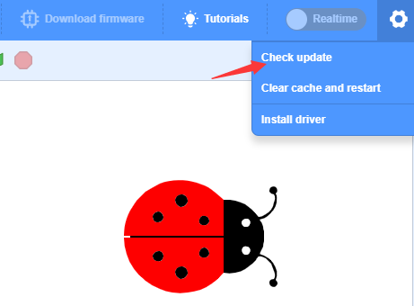
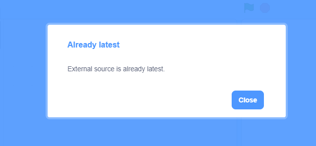

# 2. KidsBlock Software
Note: We take the Windows system as an example. 

1. Download link: `https://www.kidsblock.cn/Down/KidsBlock.exe` .  
Double click “KidsBlock Desktop.exe”
.

2. Click **Anyone who uses this computer(all users)** and **Next**.

3. Click **Browse（B）...** to choose the Disk where the software will be placed（here, we choose C Drive），then click **Install**.
 

4. After a few seconds, the installation is complete.
Tap **Finish** to open the installed Kidsblock software.

5. If the computer security alert window appears, click **Allow access**, the interface of the software is below:

6. Update the latest version of the KidsBlock

We can manually update the software in the Settings

If it is the latest version, it will display

