# Kidsblock动画编程

## 1. 动画编程界面
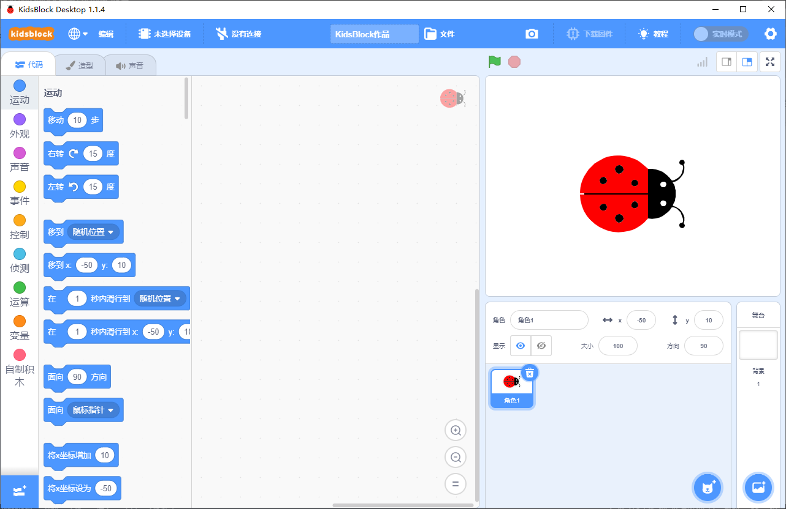

## 2.让角色动起来

用鼠标从【代码】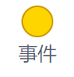

---

把模块拖到脚本区，

---

再从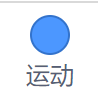中把拖到脚本区，并拼接到绿旗下方。

---
用鼠标点击漫画人角色就会向右移动10步， 把10步改成更多步，漫画人走得远了吗？ 如果改成负数，漫画人是不是向反方向后退了呢？

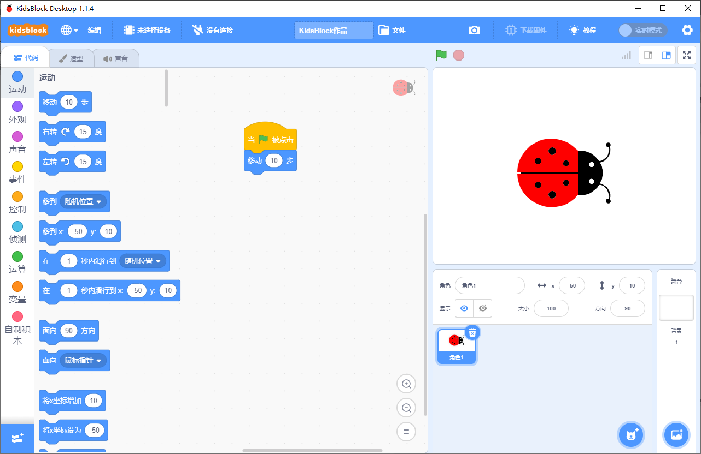

## 3. 发出声音
把【播放声音】模块拖到脚本区，对准并粘到“移动”模块下面。

点击脚本【绿旗】=运行

你会听到小瓢虫的声音。如果没听到，检查扬声器是否设成了静音。

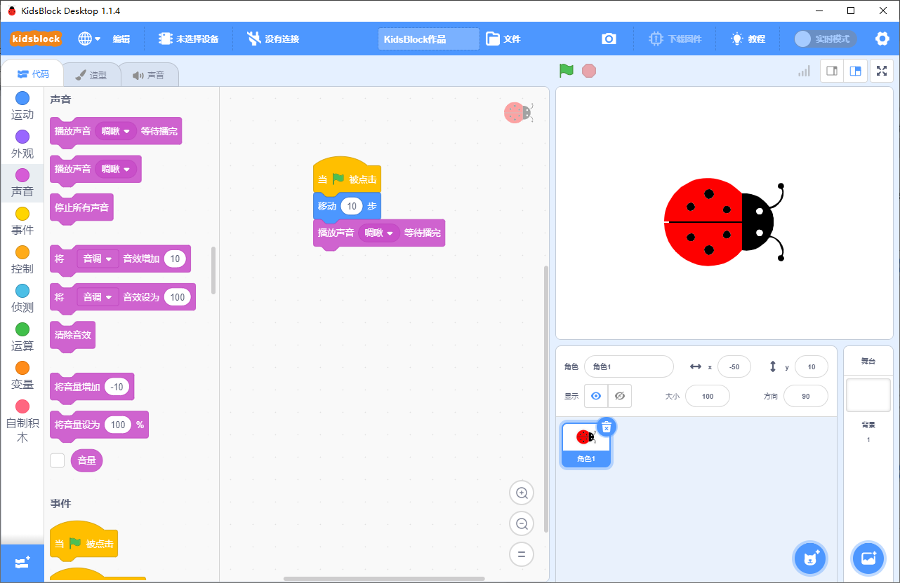

可以从左下角
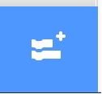
进入模块加选菜单选择
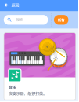
就可以获得更多的乐器声音，自己试一吧。

## 4. 随节奏跳舞
回到【运动】命令组，在脚本末尾再增加一个【移动】模块，并把移动步数改为“-10”，再到【音乐】命令组，加上一个【击打】模块，选择一个不同的鼓。 然后点击这组脚本，看漫画人随鼓声进退。

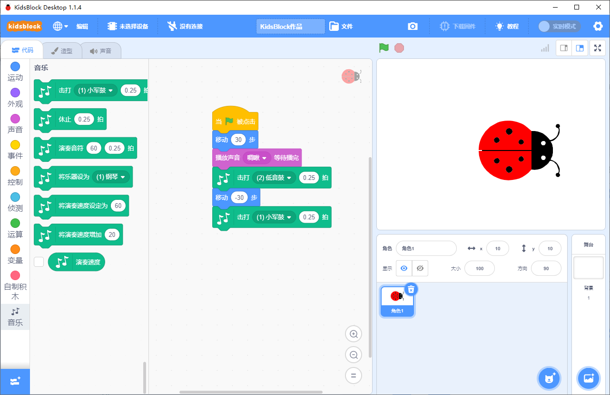

## 5. 重复执行
在【控制】命令组中，拖过来一个【重复执行】模块，对正到原来脚本顶端。结果【重复执行】模块的【大嘴】，会把原来脚本内容全部“吃下”。  点击【绿旗】脚本执行，看到漫画人多次随鼓声来回进退。 
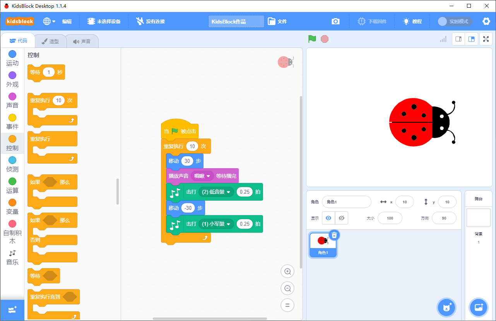

## 6. 让漫画角色人说点什么
在【外观】命令组中，拖过来一个【说】模块。
在【说】模块里面，填写上你想要漫画人说的话，然后粘到脚本最顶端，点击执行。
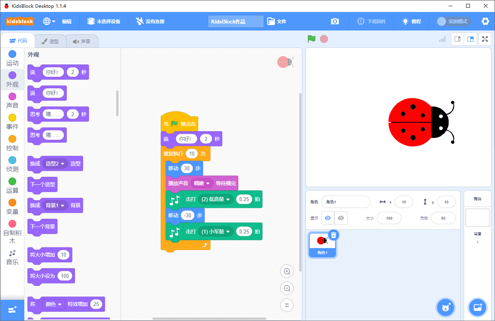

## 7. 绿旗
把【事件】命令组里面的【当绿被点击】模块，拖到脚本页程序最上方；
这样当点击绿旗时，脚本程序就会执行，红色按钮是停止。
为什么要点这里呢？在脚本下点不是一样可以运行吗？ 这是因为后面我们可以创建好多个角色，就是很多个漫画角色时，这样要一起运行就要点这个绿旗了，不然只能一个个角色单独的动作了！

<strong style="color: rgb(61, 167, 66);">绿旗</strong>

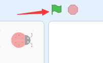

## 8. 更改颜色
从【外观】命令组中，拖过来一个【改变特效】模块 ，点击一下，看漫画人变色了。
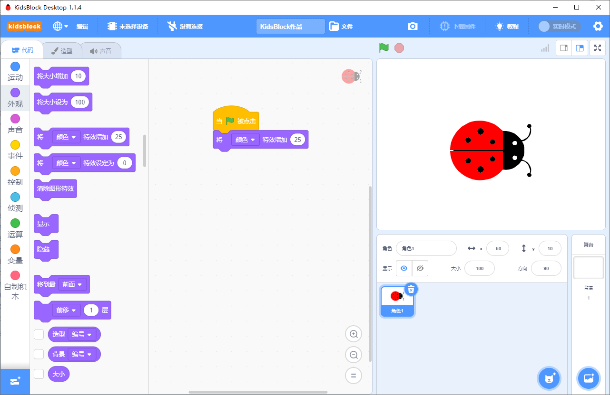

## 9. 键盘控制
从【事件】命令组中，拖动一个【按键事件】模块，放到上一步的【增加颜色特效】模块上。
然后按空格键，看漫画人随着按键变色了吗？
注：按黑色的小三角，弹出下拉菜单，可以选择其它的键，试一下，用键盘上的上下键调节漫画人的颜色吧！
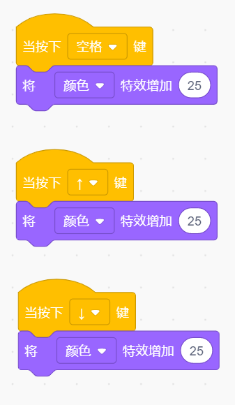

## 10. 给舞台加背景
点击图示中按钮，从背景库中选择背景。
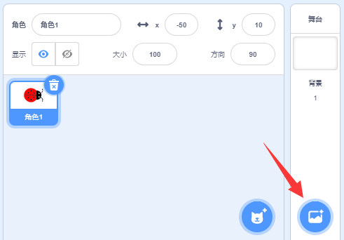

背景库里有好多好多的背景，选择一个点【确定】
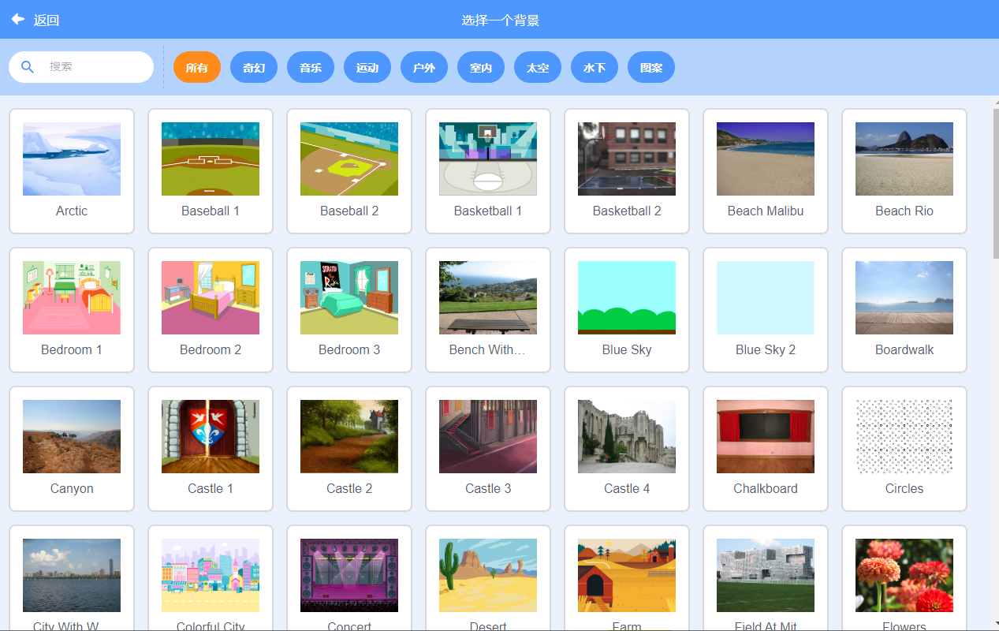

舞台是不是瞬间变的丰富多彩。
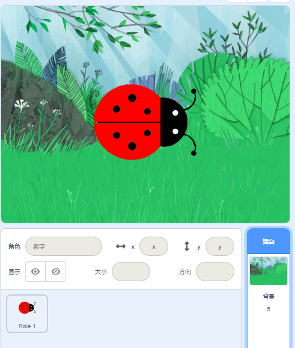

## 11. 增加角色
Kidsblock 里面有好多角色（英文：Sprite）,程序脚本就是让角色按我们的想法动起来。
新增角色的4种方法：
1. 从Kidsblock角色库里选择一个
2. 自己画一个角色
3. 角色在另外的图形文件中
4. 用摄像头拍照现做一个角色

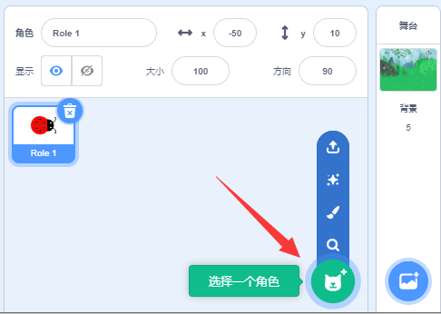

我们试一下第1种方法，点击 从角色库里选择Amon,看看是不是我们的舞台上就多一个人角色Amon了。
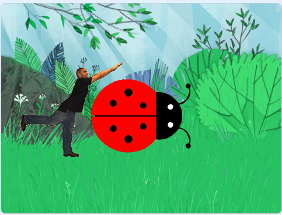

角色间程序的复制：每个角色都可以有其独立的程序，而且角色间的程序是可以复制的。
将要复制的角色下的脚本程序直接拉到要复制的角色上即可，如图：
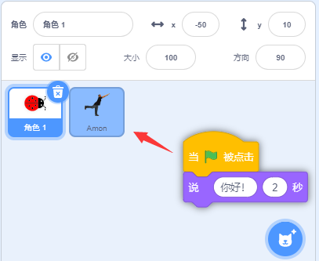

## 12. 录音
声音：你可以选择声音，也可以自己录一段声音，录制后会自动在播发模块内，如图：
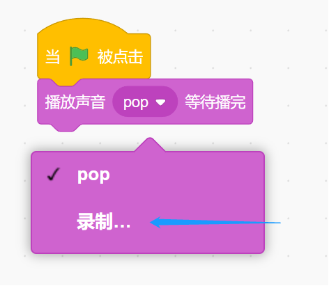

## 13. 切换造型
每个角色有很多造型，你可以在【造型】标签页中，查看选择造型。
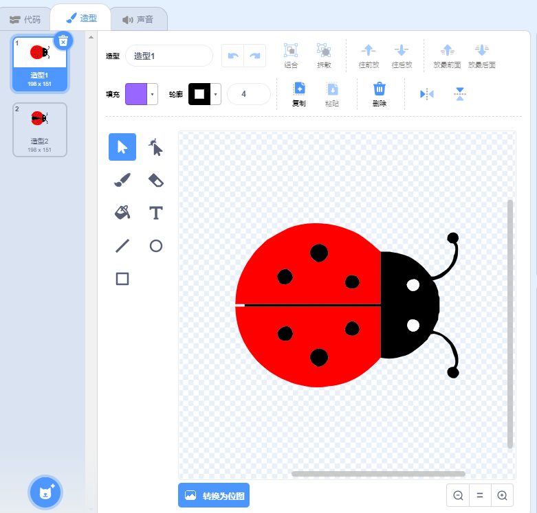

动画效果：脚本中改变造型，可以使用【外观】命令组中的【下一个造型】不停地循环变换，动画效果就出来了哦！是不是更有趣了！
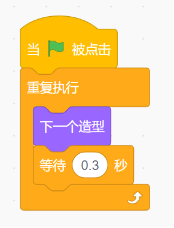

## 14. 加入条件运行的程序
写入如下程序再运行，然后输入11或其它的答案，看有什么不同？
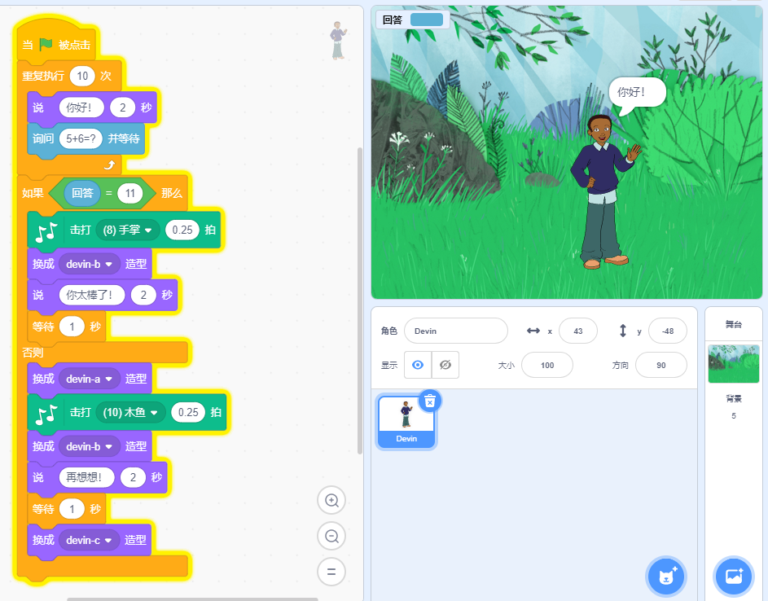
这样就形成了可活动的游戏了，而且这个规则及相关的动作是你自己定的哦，是不是很好玩，而且在玩的过程中不知不觉你的逻辑思维也提升了，从游戏的使用者变成了开发者！

## 15. 新建积木（函数）的应用
在学习之前我们先来看一下这个曲子，按不同的颜色找出规律。
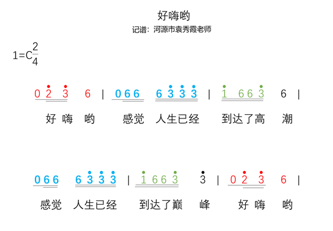
是不是相同颜色其实是一样的曲，歌词不同，但曲子是一样的，这样我们可以把重复运行的曲子模块化，在写程序时直接调用写好的块，这样省去了很多时间，同时也让程序更简化了。
编写程序：在 脚本 的 【自制积木】中找到 【制作新积木】指令，并建立3个，分别命名为part1~3，然后在part1~3中编写对应的音符，其它如图组合，并加入节奏速度调节和乐器的选择，检查程序后点绿旗运行，也可以根据自己的爱好来选择乐器及播放速度，让学习更有趣！
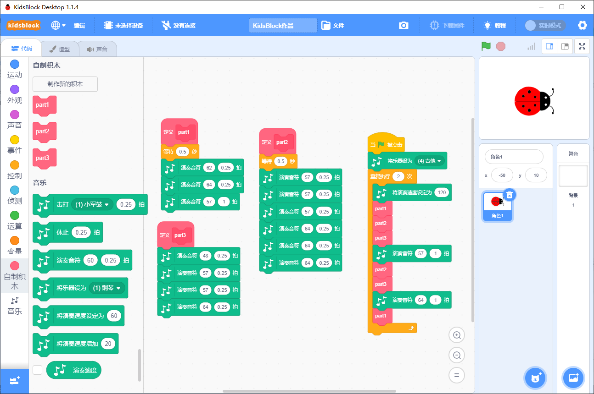

## 16. 变量的应用
变量，就是一个可以变化的数据，变量来源于数学，是计算机语言中能储存计算结果或能表示值的抽象概念。
比如老师在统计每个学生语数英的考试总分数时，计算方法都是一样，就是把三科的分数加在一起，变化的是不同学生的名字和他们各自的分数，那么在这里姓名和各自的分数及总分就是变量了。
我们以上面的例字编写一段程序，帮老师自动的计算其中一位同学的总分，程序：
在【变量】中新建5个变量，分别为：姓名、数学分数、语文分数、英语分数、总分，并从【运算】中找到【加法】，及【连接】，然后如图进行拼接，运行后会自动得出总分，角色会说明姓名及对应的总分值。
在这个公式中，老师只要输入不同学生的姓及分数，点一下绿旗，就可以得到总分了。
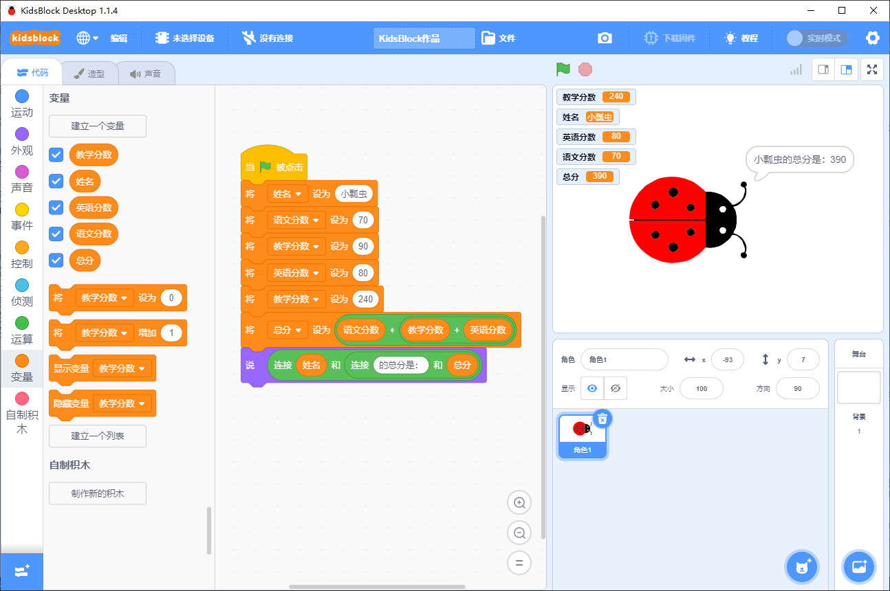

## 17. 舞台的坐标
如图，程序块内的一步为一个坐标值，以舞台中心为参考0点，分别分不同方便移动！后面的程序设计时要记得哦！
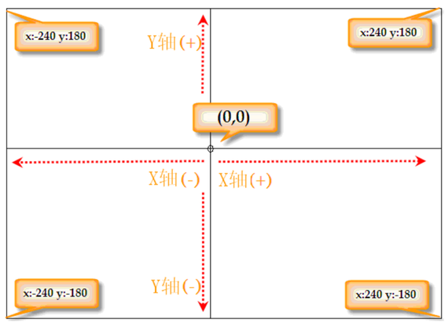
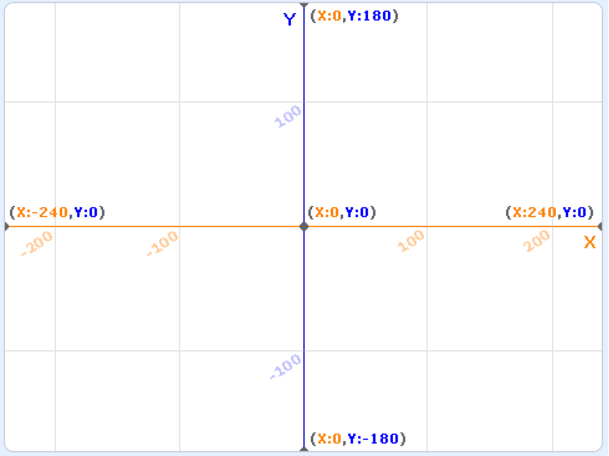

## 18. 神奇魔法师例程
如图编写一个程序，点运行后在舞台上任意位点一下，会有很神奇的效果哦，然后自己分析熟悉一下这个程序的逻辑及各功能块功能，并试着更改成不同的效果！
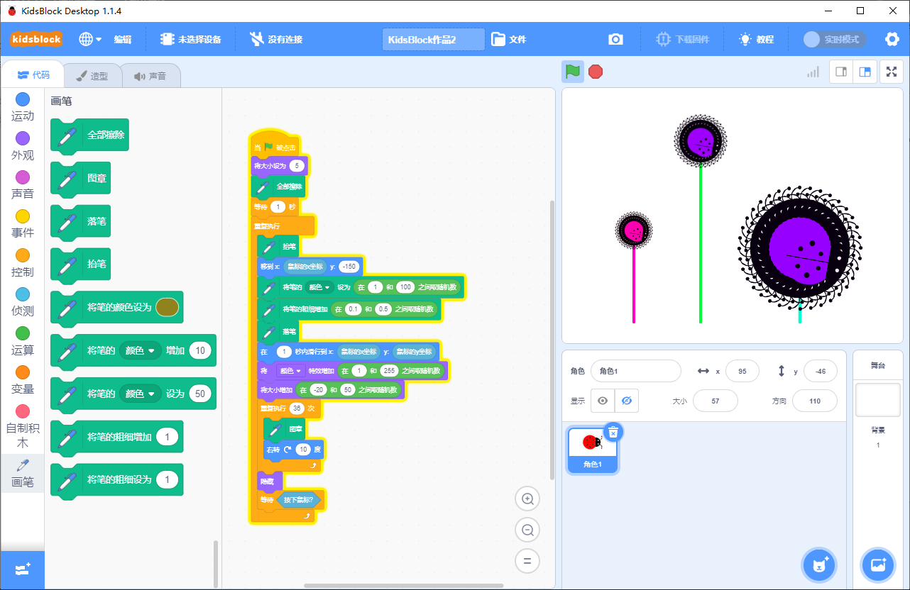

