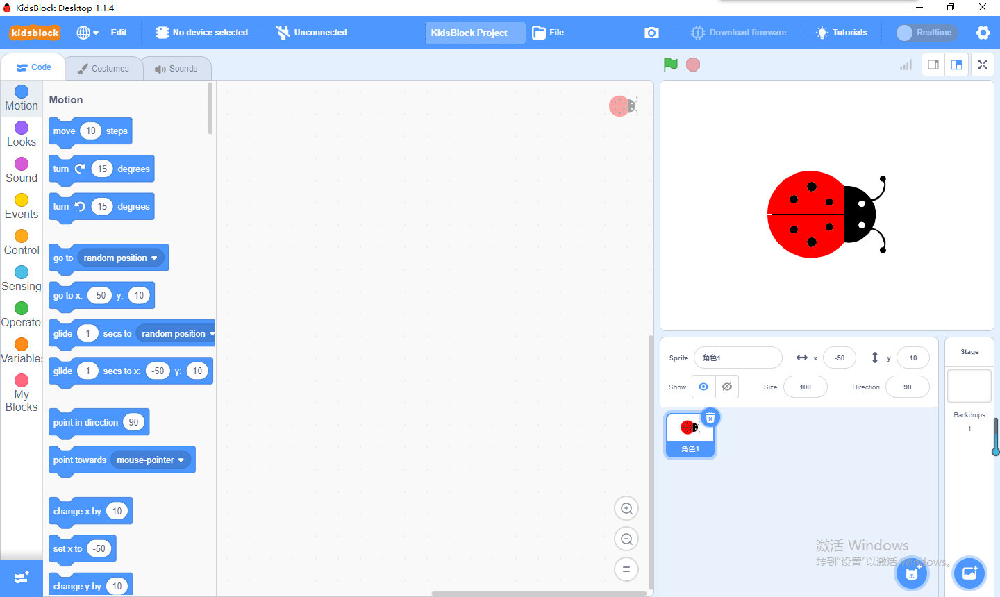
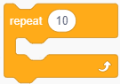
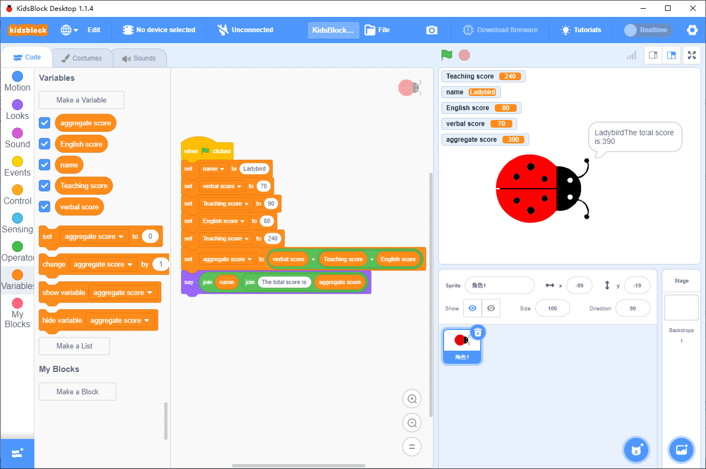

# Kidsblock Programming

# 1. Scratch Animation Programming

## 1.1 Scratch Animation and Common Programming Function

## 1.2 Move The Sprite

Drag  from  to the script editing area, and then drag the block  from  to put it under the green flag .

Click ,  and the Sprite will move 10 steps to the right. 

If you change 10 into more steps, will the little Sprite move farther?

Or, if it is changed to a negative number, will the Sprite go back in an opposite direction?

## 1.3 Emit Sound

Drag  from  and stick it under , and then click the green flag to execute these code blocks. 

You will hear that the little ladybug is calling. If not, please check whether your speaker is muted. 

Click  under the left conner to choose an extension:

In this way, more options of music are provided! Please have a try! 

## 1.4 Dance with the Beat

Back to , we add another , and set the steps to “-10”. 

In , pull into script and select drums. 

Click the green flag, the small insect will move back and forth with the beat. 

## 1.5 Repeat an Execution

In , find and pull it under the block . The "repeat" block will half-surround all the code blocks we have set. 

Click the green flag, and the insect will repeat the previous movement. 

## 1.6 Speak

In , drag a "say" block: .

Paste the "say" block under , and click the green flag. 

## 1.7 Green Flag

Block  in  should put on the first place of a complete code. Therefore, when you click the green flag, its following code will be executed; while the red button is clicked, execution stops. 

<strong style="color: rgb(61, 167, 66);">Green Flag</strong>

Why should we click here rather than the one on the block? 

Because when there are many comic characters, you have to click this green flag if you want to make them move altogether. Otherwise, you can only run each character code individually!

## 1.8 Change Color

In , find  and drag it to the editing area. 

Click to execute, and you will see the color changed. 

## 1.9 Key Control

In , drag a  above last block we have put. According to the block, press the corresponding key on your keyboard, do you see the color changed?

Tap the little triangle, a drop-down menu will show up. Then you can choose a key as you like to change the color of that ladybug!

## 1.10 Add a Backdrop

Click  to select a backdrop from the library: 

Choose a backdrop as you like and click it to set. 

Now the stage become colorful!

## 1.11 Create a Sprite

Various Sprites are integrated in Scratch, and we construct code blocks to move them at will. 

Here are four methods to create a new Sprite:

1. Choose one from Scratch Sprite library
2. Draw one by yourself
3. Add an image file
4. Take a photo

Let's try Method 1: Click  

to select one from the library. 

Here we choose Amon:  

 and Amon will show up on the stage!

**Copy the code block among Sprites:**

Each Sprite enjoys its own code, which can be copied to others. For how? Just directly drag the script program to the Sprite that you want to be copied: 

## 1.12 Record

In  

 find  
. 

Click the triangle to select "record...". After recording, it will be automatically displayed in the menu. 

## 1.13 Switch Costume

Multiple costumes for every Sprite can be found in : 

**Dynamic effect**: Add a  
 
in "forever" block as below, and when you execute them, a dynamic effect will be presented! It is so interesting, isn't it?

## 1.14 Add a Condition

Construct the following code blocks, and answer it "11" and other numbers, do you see the difference?

Now it is an interactive game! Moreover, you can set rules of the game by yourself, which can cultivate you logic thinking. And you are a game developer now!

## 1.15 Block (Function)
Before all, let's take a look at this song and find out some rules according to different colors.

The same rhythm is in the same color, so we can set the same part as a module block. When using, we can call the block directly to save time. 

**Programming:** 

In  

 find  
  
and make three blocks respectively name them part 1, part 2 and part 3. Among them, compose notes as followings, and we add some beats and instruments.

Click the green flag, music starts to play! 

Of course you can compose a music and set its playing speed at will! Hope you enjoy the joy of creating!

## 1.16 Variable
A variable is a piece of data that can change. It originates from mathematics and it is an abstract concept in computer language that can store calculation results or represent values.

For instance, a teacher counts the total score of each student's Chinese, Mathematics and English test, in which the calculation method is the same (scores of the three subjects are added together), but the names of students and their respective scores are different. In this example, the score and total score are variables.

Based on this example, we write a program to calculate the total score: 

In  

, click  
 
to make five variables: name, aggregate score, English score, Teaching score and verbal score.  

Find  

 and  

in  

, and connect them as shown below. After execution, click the green flag, and the total score with names will be automatically calculated and output. 

## 1.17 Coordinate of the Stage
A step equals a coordinate value.

Taking the center of the stage as the reference point 0, it is divided into different parts for movement! Do remember that when designing the program later!

## 1.18 A Magician
Write a program as shown below. 

Click any position on the stage, and it will show a magical effect. Please analyze and familiarize with the logic of the program and the functions of each block by yourself, and try to re-construct it for different effect!

