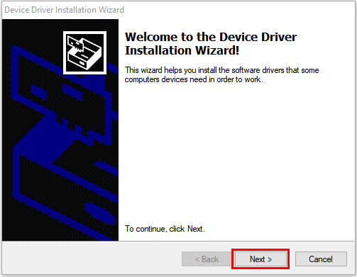
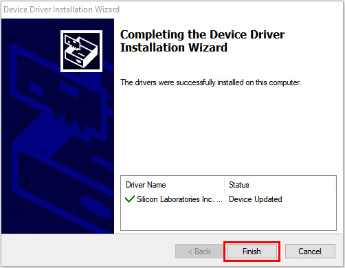
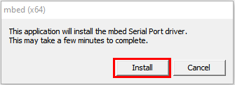
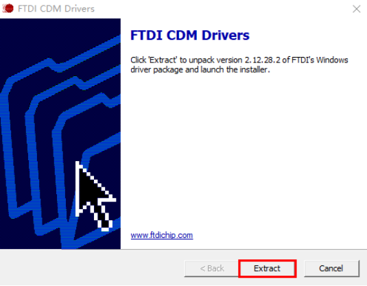
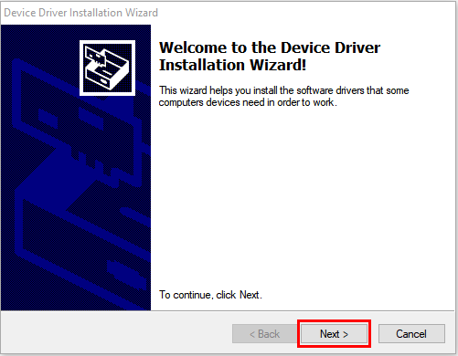
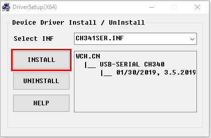

# How to install driver

Tap to select **Install driver**.（Note: If the driver is not installed, as shown below:

A.Click **Next** at the **Device Driver Installation Wizard page**.

B.After a while, click **Finish**

C.Then click **Next**

D.And click **Finish**

E.Then click **Allow** and **Install**

F.After a while，click **Finish**

G.Select **Extract**

H.Click **Next**

I.Next, click **I accept this agreement** and **Next**

J.Click **Finish**

K.After a while, click **INSTALL**

O.After a few seconds, when the driver is installed, just click **OK**

