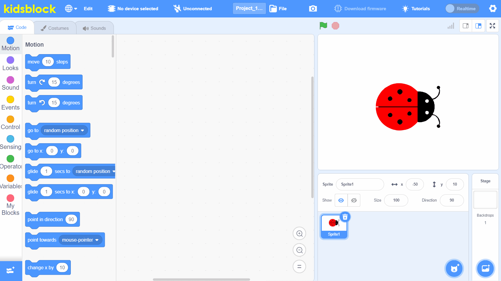
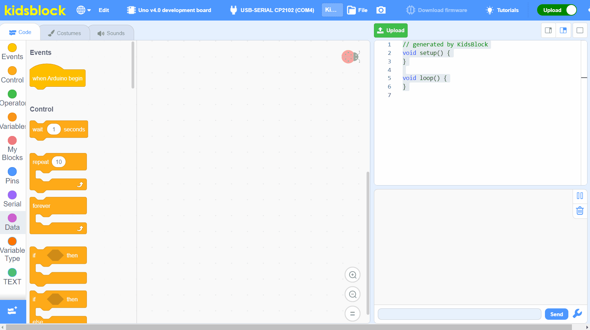

# Graphical programming with a low barrier to entry

# Support mainstream open source hardware platforms in offline state

# Support multiple electronic modules

# Automatically convert C language code

