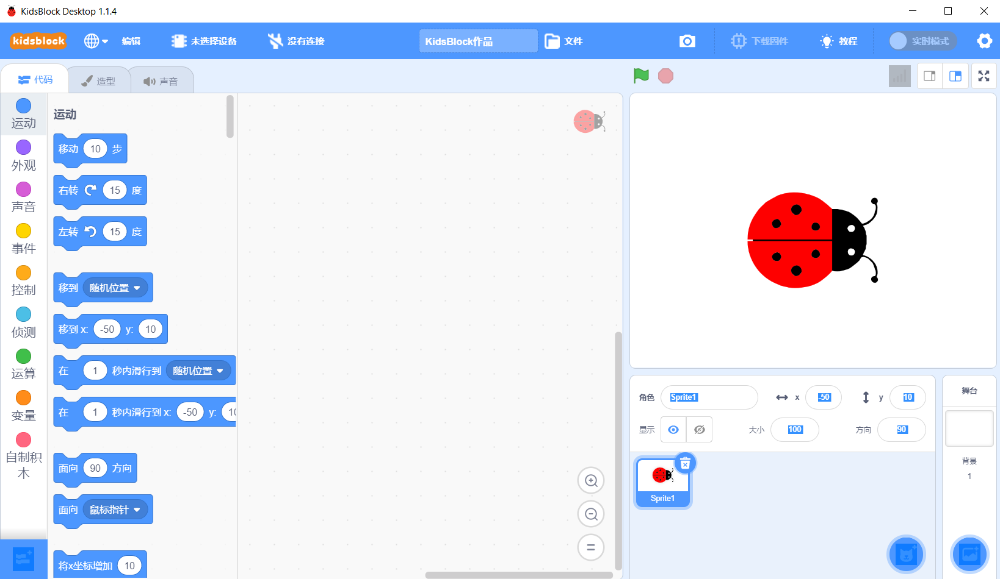
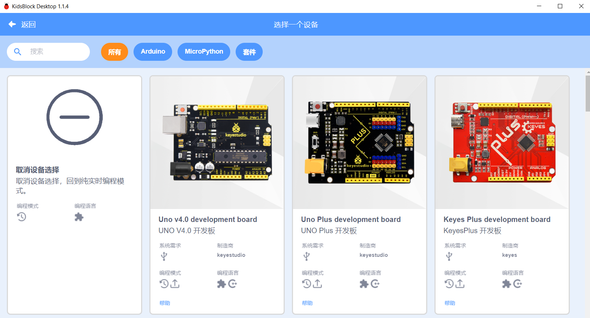
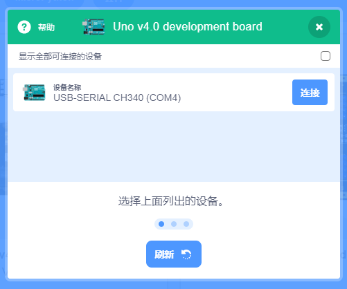
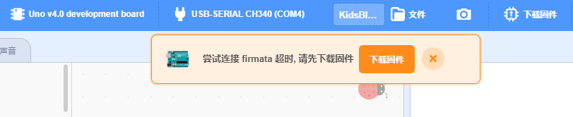
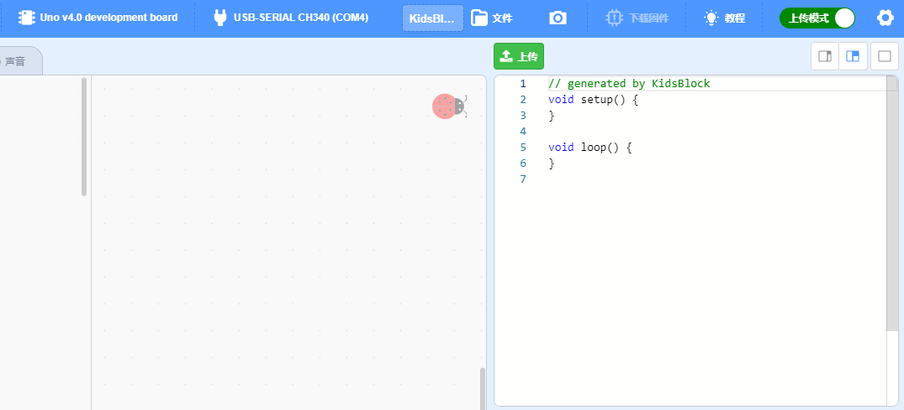
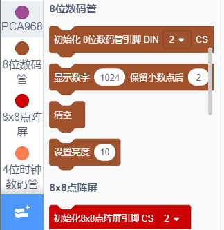
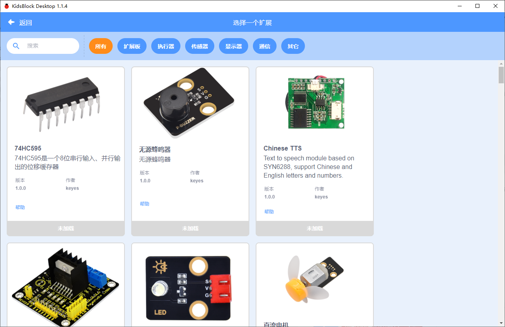
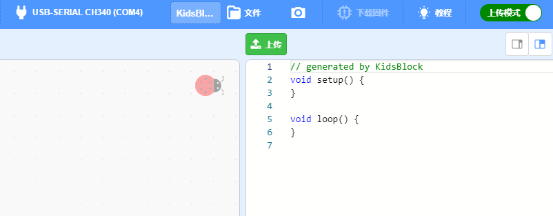
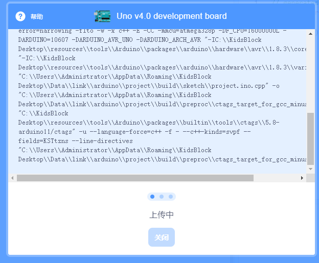

# 软件常用功能
### 1. 硬件的选择
开启软件后默认的界面是Scratch动画编程，如果这时你不想跟任何硬件连接，就不必要切换别的界面，这是跟原生Scratch3.0界面一样。

当要选择硬件编程或硬件跟动画实时互动编程时，就要选择硬件，如图：

选择硬件对应的串口

在选择对应的硬件后会自动跳转到编程语言的选择及串口硬件（COM），这里选择在要跟硬件驱动的一样，同时注意不要开启多个有串口应用的软件，不然你找不到可能是被别的软件占用了端口，或没有驱动成功。

## 2. 实时模式
实时模式：可以与动画互动编程，比如当硬件按下程序设定的按钮时，动画做出动作反应，或动画达到编程条件时戏驱动硬件动作。
此模式运行前要下载软件对应的硬件固件，如图：

## 3. 上传模式
上传模式：可以将程序完全的跟其它IDE一样上传到硬件内永久保存运行。

此模式下也一样要先选择对应的硬件，操作与实时模式相同。当切换到上传模式时只有对硬件主板或模块的编程，此时跟动画是无任何关系了。
通常当你选择一个硬件主板后会有一些常用的主板编程功能在左侧，如果要更多的模块你可以选择软件左下角的加号添加功能，如图：

这时进入了模块选择，对应的编程块也会自动添加在左侧的编程列表最下面，如图：

上传程序：当一个程序编程写完成后，可以点软件上面功能键**上传**，注意这时要保证硬件连接是否正常，程序的逻辑或相关变量定义正确性，否则都不能上传或在编译时提示程序逻辑的错误。（编译的过程及上传速度与程序的复杂程度及电脑配置有关，如果长时间与硬件达不成上传通讯会自动停止，这时请检查硬件的稳定性）

