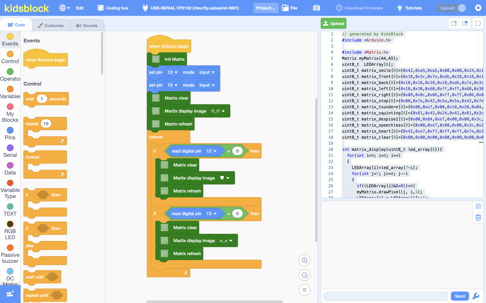

# Welcome to Kidsblock

**The Kidblock, based on the Scratch graphical programming software, integrates multiple mainstream mainboards, sensors as well as modules. It can be programmed by dragging graphical blocks and using the C/C++ programming language, making programming easy and interesting for children to learn.**

