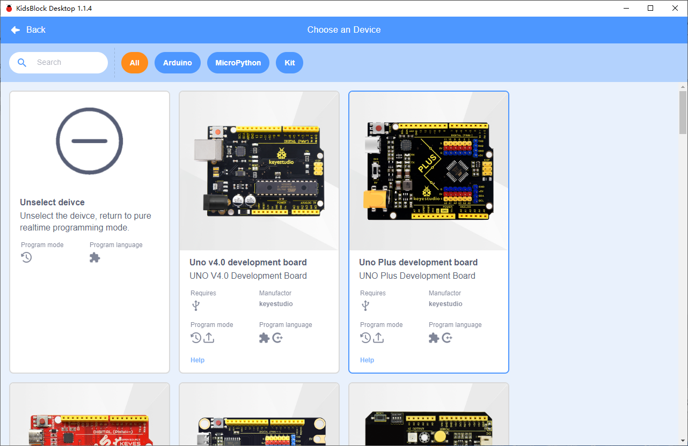
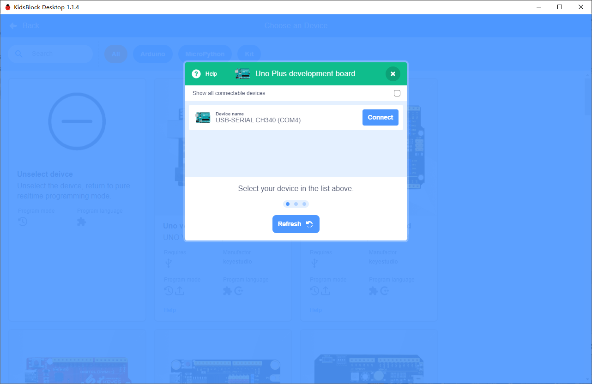
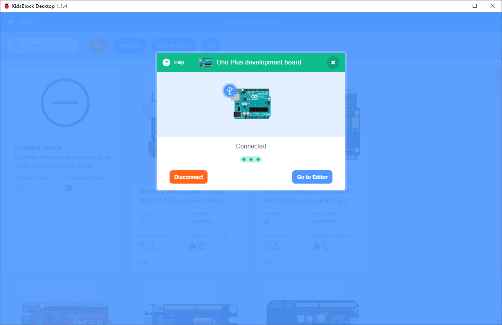
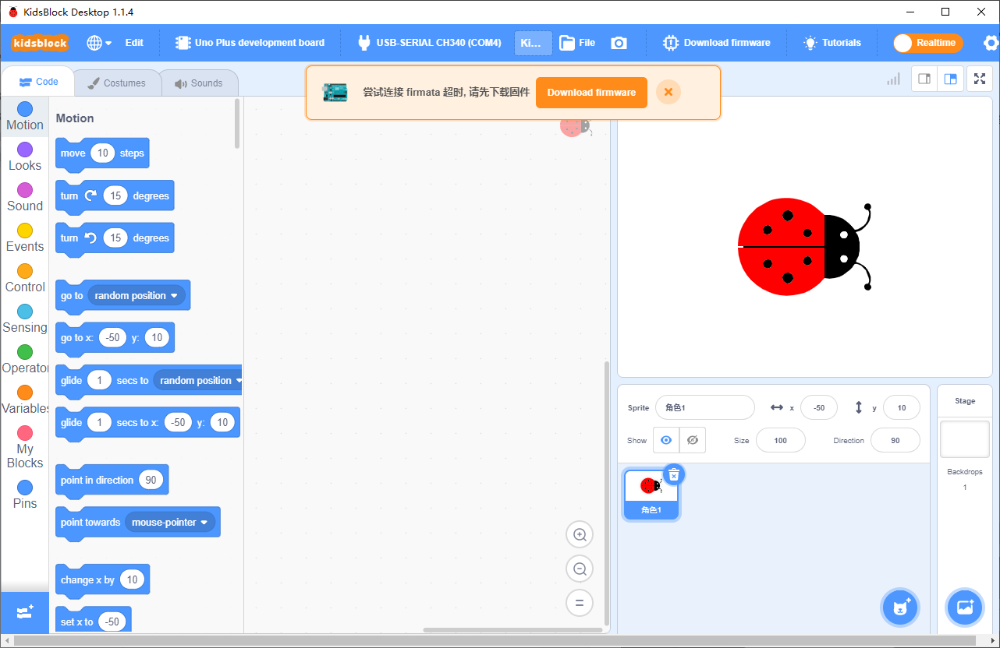
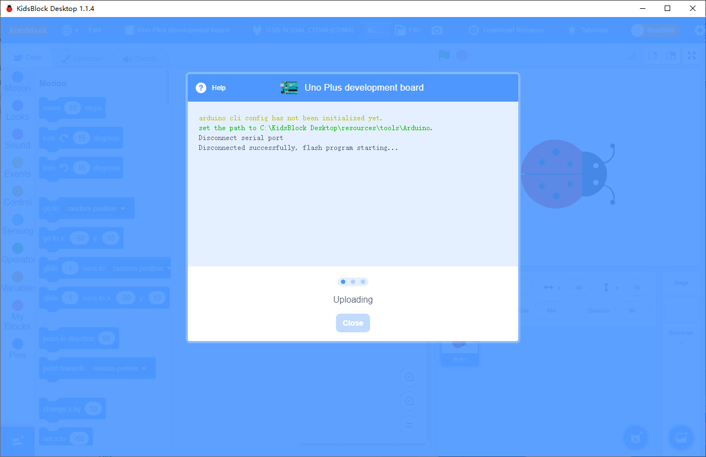

# Realtime Mode
Realtime mode integrates animation and hardware programming. When any condition is met, the animation or hardware makes the conditional action. They communicate with each other to share data.

**NOTE:**

* In realtime mode, please choose **Arduino** programming language when selecting hardware. Do connect the correct COM Serial Port and make sure the mode is **Realtime**! 
* In realtime mode, when connecting hardware for the first time, remember to **unload firmware** to load a code on mainboard to make interaction between hardware and software, so that data are shared. 
* We will demonstrate the application of **Realtime** mode on UNO Mainboard.

**When pressing the space key, the Sprite say "You pressed space!" and play drum; meanwhile, LED 2 will light up for 2s and then go off. **

Select **UNOplus development board**

Choose Arduino programming language.

Select COM23 as port (the number of COM port varies from computers)

After connected, go to editor.

Open the switch of **Realtime**, and upload firmware.

Wait the **uploading** to 100% and go to editor.

