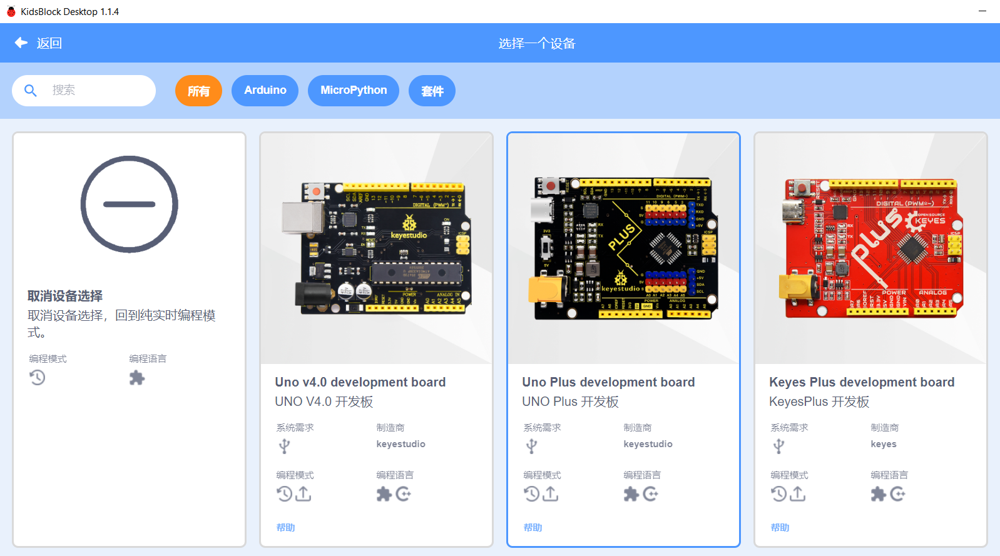
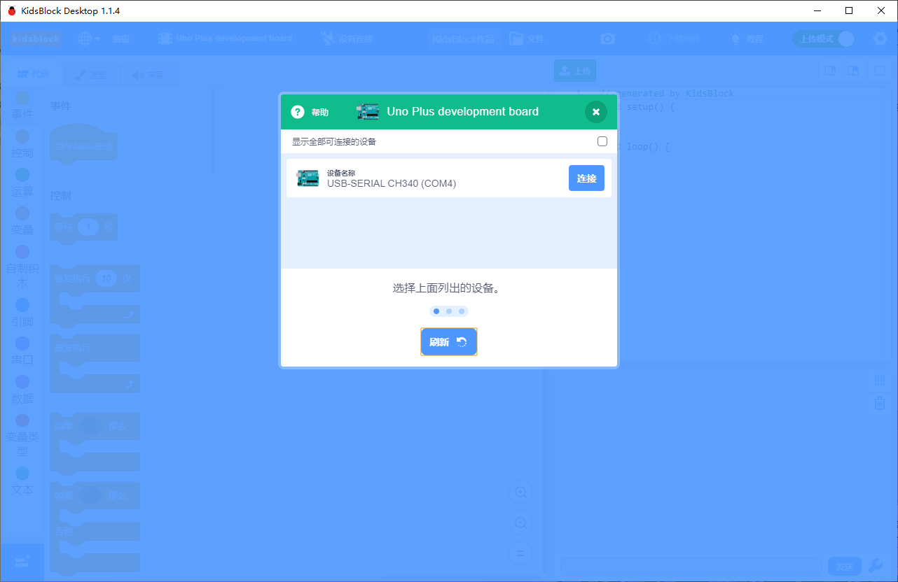
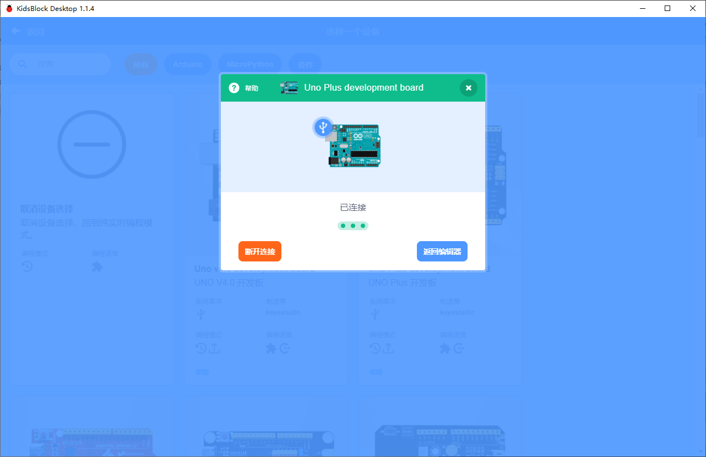
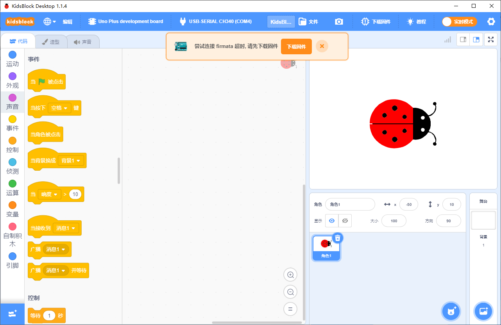
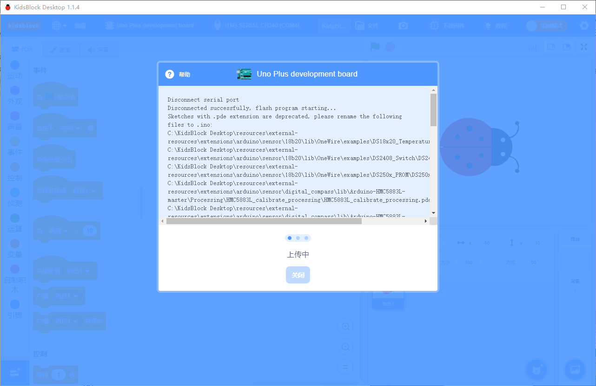

#  实时模式编程
实时（互动）模式是指动画编程与硬件编程结合，在任一条件满足时，动画或硬件做出条件的动作，就是电脑上的动画与连接电脑的硬件相互通信，数据共享融合。

**注：**
* 实时模式在选硬件时应该选**Arduino**编程语言，并正确的选择自己连接的硬件COM串口的端口号，并确认是在**实时模式**下！
* 第一次连接硬件时要在**实时模式**点**上传固件**，上传固件是将一个程序能让硬件跟软件动画互动的程序输入到硬件主板上，让它们之间建立互通的协议，以达成交互数据的目的。
* 下面我们以**UNO PLUS**主板为例，快速学习**实时模式**的应用

例：**当按下键盘空格键时，动画人说“你按下了空格”，同时发出击鼓的声音，而硬件这边也同时会互动亮起2号灯2秒后再熄灭。**

选择**UNO PLUS 开发板**

选择编程语言为Arduino

选择COM4连接主板（不同的电脑这个com号不一样，具体请查看安装教程部分的说明）

确认连接后，返回编辑器

确认在实时模式下，并点上传固件

上传固件直接100%成功，自动返回编辑器

