## **Project 1: Blinking**

**1.  Description**

LED blinking is a simple project designed for starters. You only need to install an LED on Arduino board and upload the code on Arduino IDE. 

This project reinforces the learning of Arduino conceptual framework and using methods for starters. 

**2.  Working Principle**

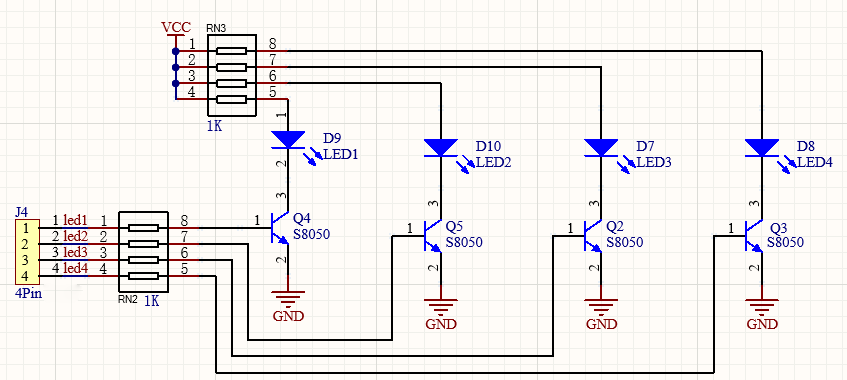
**LED lighting principle:** 

Generally speaking, limited IO ports of output current may cause enough-less brightness of LED, so NPN triode (Q2) is applied in circuit as a switch.
In this case, the LED will light up if the base(pin 1) of triode is at a high level. On the contrary, LED goes off when the base is at low.

**Triode switch controlling principle:**

To have a clear understanding of its principle, certain knowledge of electronic circuit is required. For details, please consult materials by yourself.
Briefly, LED lights up when the base(pin 1) is at a high level. In the same breath, the collector(pin 3) and emitter(pin 2) are connected, and then VCC passes through a current-limiting resistor to LED and finally to GND, which forms a circuit. On the contrary, LED goes off when the base is at low. In this circumstance, the collector and emitter are disconnected hence the circuit is not a closed loop.

**3.  Wiring Diagram**

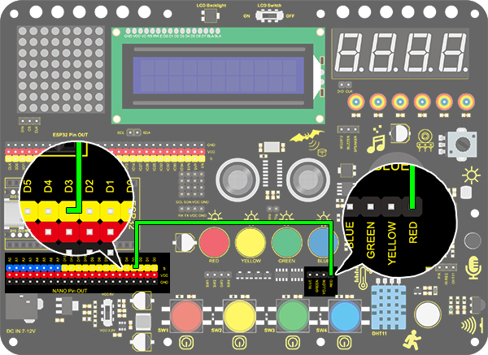

**4.  Test Code**

According to previous principles, we can control LED via power levels of pins on the development board.

1.Drag this "when Arduino begin" block in "Events".This is one basic block. Or else, the following code blocks won't execute.

2.Drag a "forever" in "Control" to circulate the execution of the including code blocks. This is another basic block.

3.Drag an "LED output" block in "LED" and set the pin to 3 and output to HIGH.

4.Drag a delay time block in "Control" and set "wait 1 seconds".

5.Set another LED output to LOW at pin 3 as well as "wait 1 seconds".

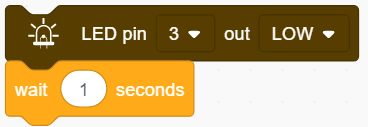

**Complete Code:**

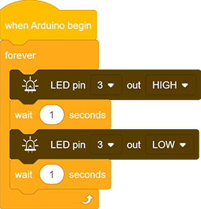

**5. Test Result**

After uploading the code and powering on, LED will blink alternatively of on for 1s and off for 1s.

**6. Code Block Description**

1.Code blocks will not execute if there is no "when Arduino begin".

2.Code blocks in this "forever" block will execute in a loop. 

3.In this block, you can choose a pin to output a HIGH or LOW level. 

4.You can type a delay time in the middle blank in the unit of seconds. 

## **Project 2：Breathing Light**

**1. Description**
Arduino breathing light utilizes on-board programmable PWM to output analog waveform. After powering on, LED brightness can be adjusted through duty cycle of the waveform to eventually realize a breathing light.
In this way, ambient light can be simulated by changing LED brightness along with time. Also, breathing light can form a colorful mini light show to construct a tranquil and warm environment.

**2. PWM Working Principle**

PWM controls analog output via digital means, which are able to adjust the duty cycle of the wave (a signal circularly shifting between high level and low level).
For Arduino, digital ports of voltage output are LOW and HIGH, which respectively correspond to 0V and 5V.
Generally, we define LOW as 0 and HIGH as 1. Arduino will output 500 signals of 0 or 1 within 1s. If they are 500 "1", 5V will be output. Oppositely, if they are all 0, the output will be 0V. Or if they are 010101010101..., the average output will be 2.5V.
In other words, output ratio of 0 and 1 affects the voltage value. Honestly, it differs from real continuous output, yet the more 0 and 1 signals are output per unit time, the more accurate the control will be.

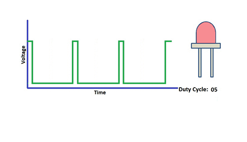

**3. Wiring Diagram**

**4. Test Code**

We adopt "for" statement to increase a variable from 0 to 255, and we define the variable as PWM output (analogWrite(pin, value)). By the way, a delay time may reinforce the control of LED shining time. Next, we use another "for" statement to decrease it from 255 to 0 with also a delay time to control LED dimming process.
As a result, a breathing light is complete.

1.Drag the basic two code blocks.

2.Drag the following block from "Variable Type", and define the name to "item" with an initial assignment "0". Put this block in "forever". 

3.Drag a "repeat" block from "control" and set it to 255 times, which is the maximum value of PWM.

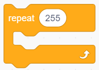

4.Drag a "Change" block from "Variable Type", put "item" as its changed object and set the mode to "++".

5.Drag an "analogWrite" from “LED” and set the LED pin to 3. Then add an "variable" block in it and fill in the blank with "item". 

6.Drag a delay time block from "Control" and set the waiting time to 0.01s = 10ms. 

7.According to previous steps, build another code block with the only difference of variable mode "– –".

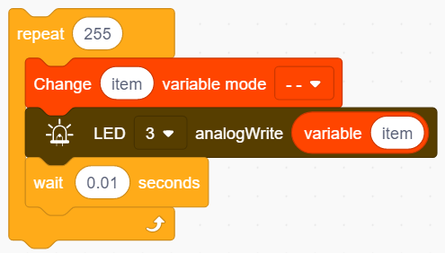

**Complete Code:**

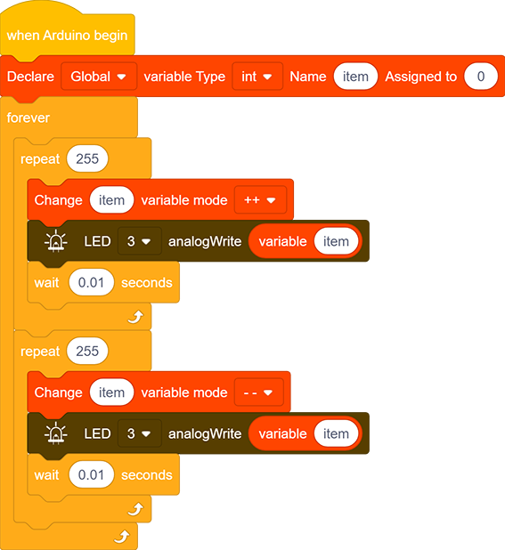

**5. Test Result**

After uploading the code, we can see the LED dims gradually rather than all of a sudden. It "breathes" evenly.
**6. Code Block Explanation**

1.This definition block is used to set variable usable range, variable type , name and its initial value. 

2.Repeating times can be assigned in the blank of this repeat block. 

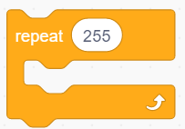

3.This block adds one to the variable. Input a variable name in the blank and its value will add one each time the code executing. "++" can be altered to "– –".

4.This block suntract one from the variable. Similarly, input a variable name in the blank and its value will reduce one each time the code executing. 

5.A certain analog output value and pins can be set in this PWM outptu block. Totally, six pins on Nano board cater for PWM, including pin 3, 5, 6, 9, 10 and 11. Besides, the analog value can be scheduled in the blank. 

## **Project 3：SOS Distress Device**

**1. Description**

Arduino SOS device is able to emit distress signals, which coincide with the principle of Morse code. It is convenient for emergencies.

**2. Wiring Diagram**

**3. Test Code**

What we should clear firstly is how SOS distress light blinks: LED quickly blinks three times for “S” and slowly blinks three times for “O”.
And then, we control the blinking times and duration via "for" statement and set interval time among letters.

1.Drag the two basic code blocks.

**Letter "S"**

2.Drag a "repeat" block from "Control" and set to 3 times, as "S" only needs to blink for 3 times. 

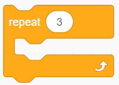

3.Drag an “LED output” block from "LED" and set the output to HIGH at pin 3. Put a delay block after it and set the its time to 0.15s.

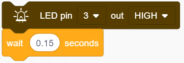

4.Drag another “LED output” block and set the output to LOW at pin 3. Also add a delay block after it but set the waiting time to 0.1s.

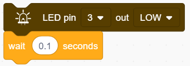

**Letter "O"**

5.Refering to previous steps, build the following code block. Modify the HIGH ouput to delay 0.4s and LOW to 0.2s.

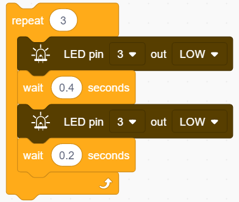

**Letter "S"**

6.Operate step 2, 3 and 4 again. 

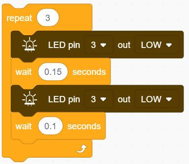

7.Add a delay time of 5s to the end, and "SOS" will repeat every 5s. 

**Complete Code:**

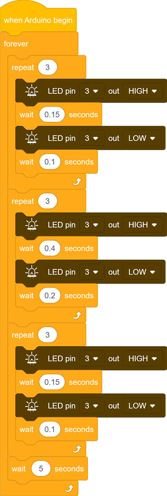

**4. Test Result**

After uploading the code, LED respectively blinks for 3 times in the sequence of quick, slow and quick, which forms "S.O.S". It repeates after 5s.

## **Project 4：Traffic Light**

**1. Description**

The traffic light module limits the pedestrian and vehicular thoroughfare. It includes a red, a yellow and a green light, which imply different instructions.
**Red for Stop:** Pedestrians and vehicles stop proceeding.
**Yellow for Caution:** Pedestrians and vehicles are ready for stopping. If the drive is already in process, the speed should be slow.
**Green for Proceed:** Pedestrians and vehicles keep going with the abidance of traffic regulations.

In this project, you can program to control a mini traffic light. For instance, set the duration of each lights and the interval time among them. Besides, you may also add a timer to alter light colors to schedule.

**2. Wiring Diagram**

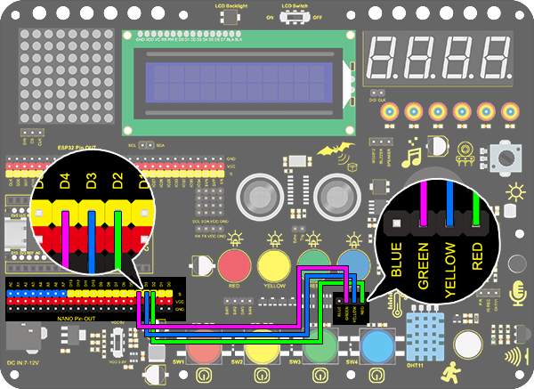

**3. Test Code**

We simply stimulate the traffic light: green LED lights up for 5s, yellow LED blinks for 3 times, and red LED lights up for 5s. And we set this to loop.
The blinking of yellow LED can utilize the code blocks we have mentioned in project 3. Thus, we now only need to set a lighting time to complete a traffic light.

1.Drag the two basic code blocks.

2.**Green LED lights for 5s:** Drag an “LED output” block from "LED" and set the output to HIGH at pin 4. Place a delay block after it and set the waiting time to 5s. Drag another “LED output” block but set the it to LOW. 

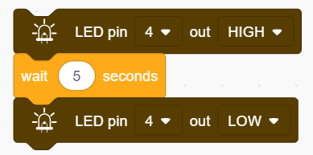

3.**Yellow LED blinks 3 times:** Drag a "repeat" block from "Control" and set it to 3 times. Put an “LED output” block in it and set the output to HIGH at pin 4 followed by a 0.5s delay time. Repeat this step but set the output to LOW, as shown below. 

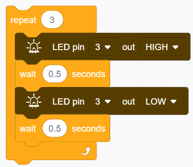

4.**Red LED lights for 5s:** Do the same as step to, but set the output pin to 2. 

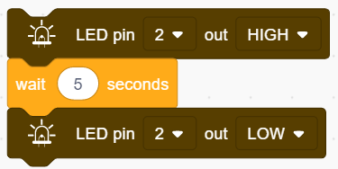

**Complete Code:**

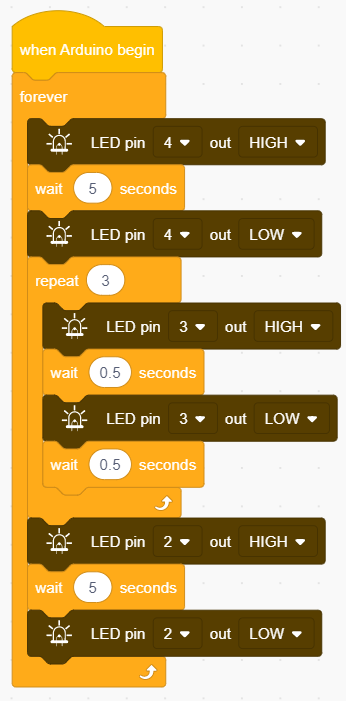

**4. Test Result**

After uploading the code, green LED will light up for 5s, yellow LED will blink for 3 times, and red LED will light up for also 5s, in circulation.

## **Project 5：Rainbow Ambient Light**

**1. Description**

Arduino 2812RGB LED is a programable colorful dreamy light, whose lighting color, brightness and rhythm are adjustable.
This rainbow ambient light can used as a dynamic decoration at will. Or you may control it to "dance with music".

Importantly, it can be improved as an alarm. Its built-in sensor detects the ambient surroundings to warn users by changing lighting colors, brightness and rhythm.

**2. Working Principle**

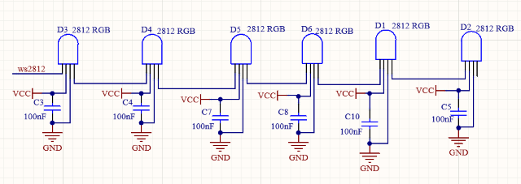
**Working Principle:** 

The data protocol adopts communication mode of single-line RTZ code.
After powering on and pixel resetting, DIN terminal receives data from the controller. The firstly arriving 24bit data will be extracted by the first pixel and be sent to the inner data register. And remaining data will be amplified by an amplification circuit and be transmitted through DOUT port to the next cascaded pixel. After being transmitted through pixels, the signal decreases 24bit each time.
Besides, the automatic amplification and transmitting technology offer unlimited number of cascade from signal transmitting, yet it is limited by transmitting speed.

**3.Wiring Diagram**

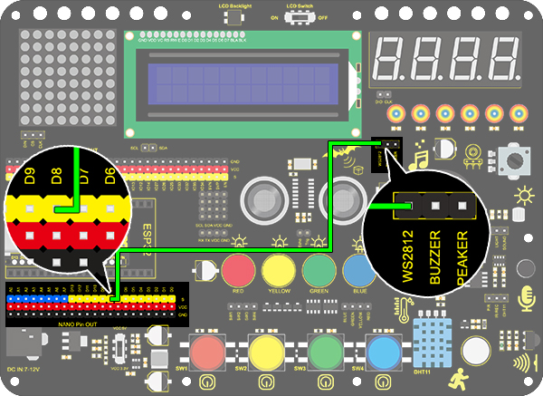

**4. Test Code**

To begin with, let's learn how to set 2812 RGB colors! 

1.Drag the two basic code blocks.

2.Drag a “RGB LED” block from “RGB LED” and set the pin to 8 and the number of LED to 6.

3.Drag an “LED brightness” block from “RGB LED” and set the pin to 8 and the brightness to 20. We don't recommend you to set it particularly bright, as it is bad for your eyes when debugging.

4.Drag a "clear all LEDs" block and set the pin to 8. 

5.Drag six "show color" blocks and set pins to all 8. Orderly, define the RGB as: 0 to 0, 1 to 1, 2 to 2, 3 to 3, 4 to 4, 5 to 5, which respectively correspond to red, green, blue, purple and white. 

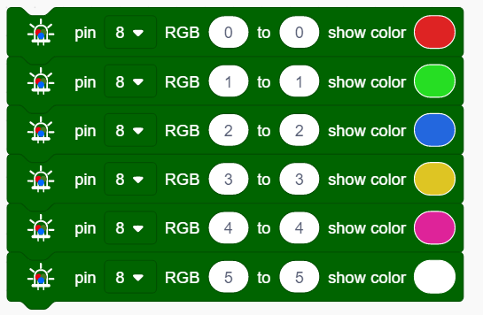

**Complete Code:**

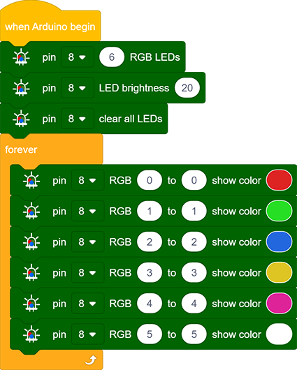

**5. Test Result**

After uploading code, wiring up and powering on, the LED will light up in different colors as the scheduled sequence.

**6. Expansion Code**

In this expansion project, let's model a mini light show!

1.Nest three "repeat" block and add a "variable +" in each, as follows. 

2.Put the above three variables in "RGB" block so that these color values are controlled. 

3.Put the "RGB" block in a "show color" block to display colors. And define a variable item to control the showing LED.

**Complete Code:**

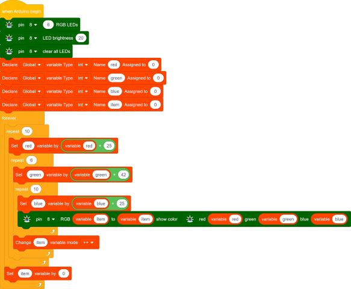

**7. Code Block Explanation**

1.Set the number of 2812 RGB. One development pin can control multiple 2812 RGB LEDs, so we need to set the number in advance and select the connecting pin. 

2.Set the brightness of 2812 RGB. Select the pin firstly and input the brightness value within 0-255, in which 255 is the brightest.

3.Turn off all 2812 RGB. This block clears all LED by selecting their common affecting pin. 

4.Control the display of 2812 RGB. We can fill the blanks to control the lighting LED and its color after selecting the pin. For instance, "0 to 0" means only the first LED lights up. After uploading the code, the first LED will turn on in the set color.

**NOTE:** The two blanks also can be filled with variables, so that a light show is able to be formed. 

5.Set the color of 2812 RGB. The displaying color can be modulated by the value in red, green and blue(R, G and B). Although we have covered how to set the showing color in Point 4, it is a direct choice which does not facilitate the control of code. Thus, we add this block in the color settings of 2812 RGB.

6.Set a gradient color of 2812 RGB. We firstly choose the pin and lighting LED(0-5 means all six LED), and then set the color value from 0 to 360. Variables also can be added. 

7.Set the distance. The blank should be input a number to indicate the shift distance. In this example code, it means to shift 1 unit in each loop. 

8.Set the rotation distance. We set the pin and input the rotation distance in the blank .

9.We set the pin firstly and define the pixel to "0 to 5". The max value is 360. We light 2812 RGB up through setting the current value. When the current value equals the maximum, all six LED light up.

## **Project 6：Water Flow Light**

**1. Description**

This simple water flow light project guides you in electronic packaging. In this project, we control LED to shift the color in a specified speed.

**2. Wiring Diagram**

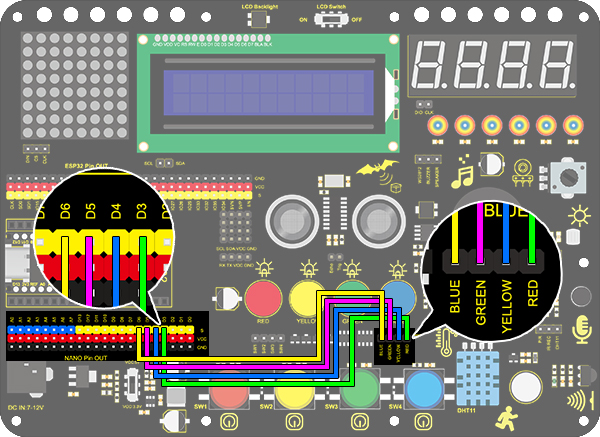

**3. Test Code**

A water flow light consists of a stream of LED lighting from left to right and vice versa.

1.Drag the two basic code blocks.

2.Drag two "LED output" block from "LED" and set the output to LOW at pin 6 and HIGH at pin 3. And set a 0.2s delay. 

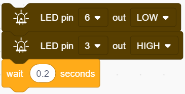

3.Drag another two "LED output" block and set the output to LOW at pin 3 and HIGH at pin 4. Also, set a 0.2s delay. 

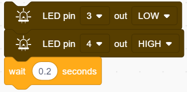

4.Similarly, set the output to LOW at pin 4 and HIGH at pin 5 with a delay time of 0.2s.

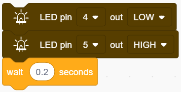

5.Again, set the output to LOW at pin 5 and HIGH at pin 6 with a delay time of 0.2s. 

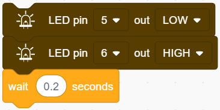

**Complete Code:**

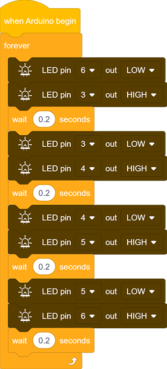

**4. Test Result**

After uploading code and powering on, the stream of LED light up from left to right and vice versa in a loop.

## **Project 7：Buzzer**
**1. Description**
An active buzzer can function as an alarm, a reminder or an entertaining device. It provides reliable voice warning for you.
What's more, it stimulates various sounds and features high controllability, so that you can experience an interesting and real experiment.

**2. Working Principle**

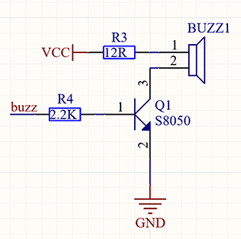

**Working Principle:** 

An active buzzer integrates a multi-vibrator, so it makes sound only by a DC voltage.
Pin 1 of the buzzer connects to VCC and pin 2 is controlled by a triode. When a high level is provided for the base (pin 1) of the triode, its collector (pin 3) and emitter (pin 2) link to GND, and then the buzzer emits sound.
Oppositely, if we offer a low level to the base, the rest of pins will be disconnected, so the buzzer will remain quiet.

**3. Wiring diagram**

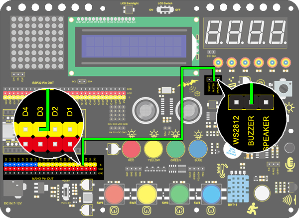

**4. Test Code**

If the development board outputs a high level, the buzzer will emit sound. If it outputs a low level, the buzzer will stop ringing.
Thus, its code is similar to light up an LED.

1.Drag the two basic code blocks.

2.Set the “Buzzer output” block from “Buzzer” to HIGH at pin 3 with a delay of 1s.

3.Set another “Buzzer output” to LOW at pin 3 also with a delay of 1s. 

**Complete Code:**

**5. Test Result**

After uploading code and powering on, the buzzer emits sound for 1s and stays quiet for another 1s, in circulation.

**6. Code Block Explanation**

Buzzer output block. We firstly define the pin to 3 and then set the output to "HIGH" or "LOW". The buzzer will beep when at HIGH, while it will be quiet at LOW.

## **Project 8：Music Performer**

**1. Description**
This project realizes a music player with an amplifier on the development board. This speaker can not only play simple songs, but also perform music made by yourself. Thus, you can program other interesting codes in the project to accomplish splendid learning outcomes.

**2. Working Principle**

**Working Principle:** 

The electrical signal is input from pin 1 of RP1 (adjusts signal intensity, which is also the sound volume).
After coupling in C4 and passing R5, the signal reaches IN- pin of 8002B, in which it is operationally amplified and output to BEE1 speaker.

**3. Wiring Diagram**

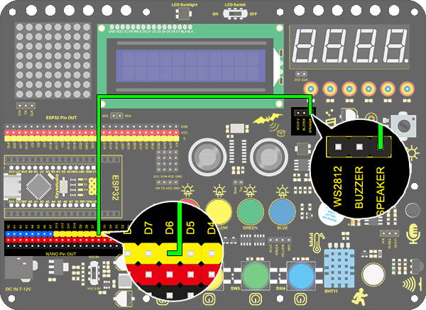

**4. Test Code**

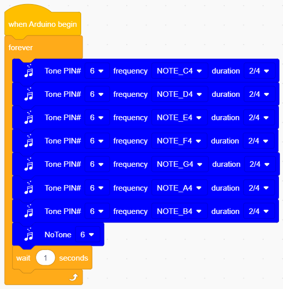

**5. Test Result**

After uploading code and powering on, the amplifier circularly plays music tones with corresponding frequency: Do, Re, Mi, Fa, So, La, Si.

**6. Expansion Code**

For a little more complicated, let's make it to play a birthday song. We have already added some songs in library so you can directly drag these song blocks from "Music". 

**Code:**

**7. Code Block Explanation**

1.Set the tone frequency. After setting the pin, we can select the frequency to compose music. However, do not forget a delay time. 

2.It is also used to set the tone frequency. What differs is that it has already included a duration so that we can omitted a delay block. 

3.Play music. For convenience, we have integrated six songs in our code blocks. Therefore, you only need to select the pin to play different songs. 

4.Quit the play. Just select the relevant pin to stop the playing song.

## **Project 9：Digital Tube Display**

**1. Description**
This display module, whose display range includes 0 ~ 9 and simple letters, consists of four digital tubes with seven LED on each and can be used as a counter or a clock.

Moreover, multiple functions can be realized by connecting their pins to the development board, such as timekeeping and some game storing.

**2. Working Principle**

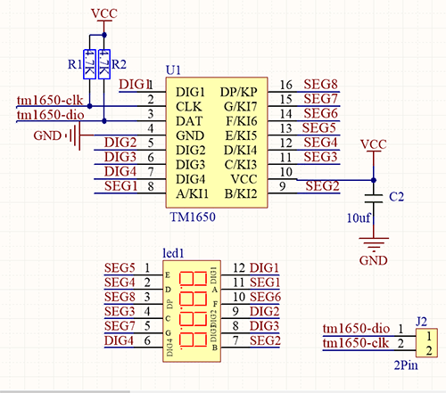

**Working Principle:** TM1650 utilizes IIC protocol and adopts two bus lines (SDA and SCL).

The code is provided in our blocks, and the digital tube will display numbers via this code. 

**3. Wiring Diagram**

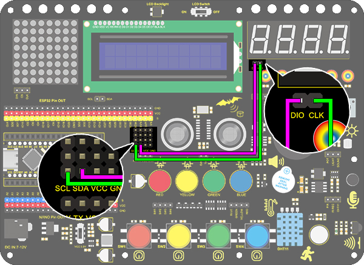

**4. Test Code**

To show numbers on the display, you only need to drag a "TM 1650 display" block from "Digital tube" and set the number string to 9999.

**5. Test Result**

After wiring up and uploading code, the digital tube display shows "9999", as shown below.

**6. Expansion Code**

Let's have some difficult operations. Rather than static numbers, we handle it to show some dynamic ones. The following code manipulates the tubes to display 1~9999 via a "for" loop.

1.Drag the two basic code blocks.

2.Drag a "variable Type" block from "Variables". Set the type to int and name to item, and assign 0 as its initial value.

3.Drag a "repeat" block from "Control" and set to 9999 times. 

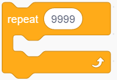

4.Drag a "variable mode" from "Variables", define its name to item and set the mode to "++".

5.Drag a "TM 1650 display" block from "Digital tube" and replace the string value with variable item. Add a delay time of 0.5s after it.  

6.Add a "set variable" block after the "repeat". Set item variable by 0. Otherwise, the item value will be out of display range after 9999 loops. 

**Complete Code:** 

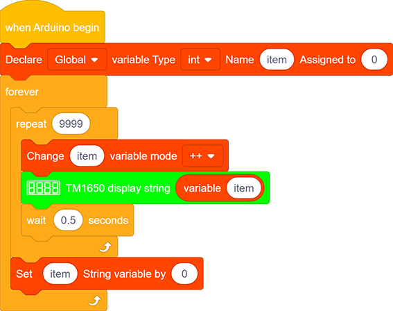

**7. Code Block Explanation**

1.Set the display string. Directly type numbers or letters you want to display in the blank. 

2.Set the ON or OFF of this TM 1650 digital tube. Each tube can be controlled separately. 

3.It is able to clear the display or used as a master switch to turn on or turn off the digital tube. 

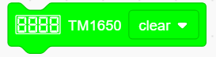

## **Project 10：Dot Matrix Display**

**1. Description**
This module consists of a 8x8 LED dot matrix with one control pin for each row as well as each column to adjust the brightness of LED.
Connecting with Arduino board, the brightness of LED is controlled via programs. In this way, simple characters and figures are able to be displayed. It also can be applied in game machines or screens.

**2. Working Principle**

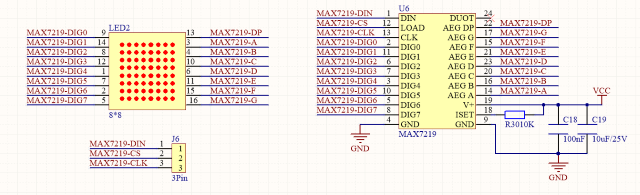

**Working Principle:** 

MAX7219 is an IC with SPI communication and controls 8x8 dot matrix. The MAX7219 SPI communication has integrated in our libraries and you can recall directly.

**3. Wring Diagram**

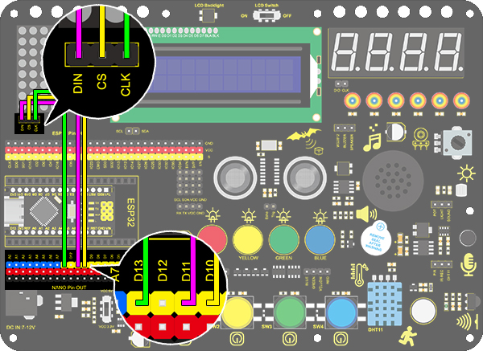

**4. Test Code**

1.Drag the two basic code blocks.

2.Drag a "init matrix display" from “Matrix” and set CS to 10. DIN and CLK are fixed pin respectively to 11 and 13.

3.Drag a "set brightness" block and set it to 3. Don't set an extreme high value when debugging. It may hurt your eyes. 

4.Drag a "image" block and choose heart icon.

5.Lastly do remember to add a "refresh" block at the end. 

**Complete Code:**

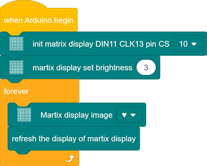

**5. Test Result**

After wiring up and uploading code, a heart will be displayed on the dot matrix, as shown below.

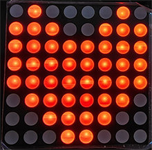

**6. Code Block Explanation**

1.Set the CS pin. In the code, DIN is fixed to 11 and SLK to 13, yet CS pin is optional. For convient wiring, we select 10 (Attention: pin 12 is not available for CS).

2.Draw pixels. This code block will light up or turn off pixels on the dot matrix by axis x and y, with red for on and black for off. 

3.Draw line. Locate the line by two group of coordinate points, also with red for on and black for off. 

4.Show characters. We have add character libraries so you only need to type a letter(only one) to display it on the dot matrix. Besides, it must be used cooperatively with a "rotation 180°" block. 

5.Show numbers. Similarly, you only need to type a number(only one) to display it on the dot matrix, and it also must be used cooperatively with a "rotation 180°" block. 

6.Show scrolling character strings. Collocating a "rotation 180°" block, the specified scrolling strings will be displayed after setting its speed. 

7.Display image. For convenience, we have already integrated some emotion icons which can be selected directly. 

8.Display fill colors. You may set to black (LED goes off) or red(LED lights up).

9.Refresh the display. The dot matrix must be refreshed if it displays something. Or else, an errer may occur.

10.Set the brightness. You can lower the brightness when debugging to avoid offending to your eyes. 

11.Set rotation angles. For high compatibility with more code, some data and icons need a rotation with the avoidence of inverted display.  That is why a "rotation 180°" block is necessary in codes. 

## **Project 11: LCD**

**1. Description**
Arduino I2C 1602 LCD is a commonly-used auxiliary device for MCU development board to connect with external sensors and modules. It features a 16-bit wide character and 2-line LCD screen, whose brightness is adjustable.

This programable module is convenient for data editing, displaying and managing. Besides, it can display not only characters and figures but sensors value, like temperature, humidity or pressure value.

As a result of its usability, the display is wildly applied in many fields, including smart home, industrial monitoring system, robot control and automatics' electronics.

**2. Working Principle**

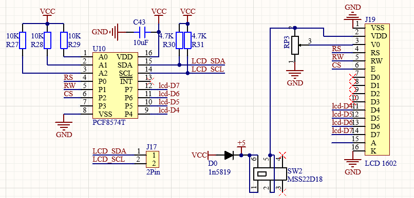

**Working Principle:** 

It is the same as IIC communication principle. Underlying functions have packaged in libraries so that you can recall them directly.

If you are interested in these, you may have a further look of underlying driving principles.

**3. Wiring Diagram**

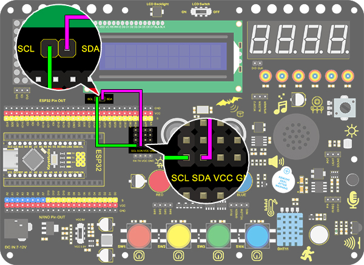

**4. Test Code**

1.Drag the two basic code blocks.

2.Drag “init LCD” block from “LCD” and set the I2C address to 0x27.

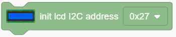

3.Drag the "LCD back light" block and set it to ON. Characters are not easy to read if there is no back light.

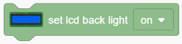

4.Drag a "LCD cursor position" block and set x to 3 and y to 0. Add an "LCD print" block and type “keyestudio” in the blank. 

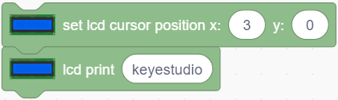

5.Again, drag another "LCD cursor position" and set x to 2 and y to 1. Add an "LCD print" and type “Hello,world!” in the blank. 

**Complete Code:**

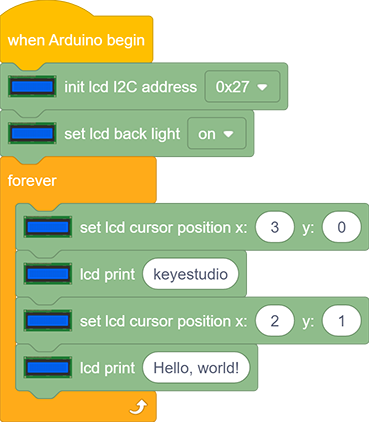

**5. Test Result**

After wiring up and uploading code, turn on the LCD, and "Hello, world!" and "keyestudio!" will displayed on the LCD.

If the characters are unclear, please fix the backlight potentiometer by the small slotted screwdriver(included in this kit). Connect an external power supply if necessary.

**6. Code Block Explanation**

1.Set the IIC communication address. In this project, the address of LCD 1602 is 0x27.

2.Control the LCD back light. The displayed characters will be seen much clearly if the back light is on. 

3.Set the cursor position. It will provide an accurate position through axis x and y. Possible values are X: 0-15 and Y: 0-1.

4.Print characters on LCD. The blank can be filled with characters or variables, which is convenient for displaying the values from sensors and modules. 

5.Blink the cursor at the display position. By default, the cursor is in inactive. 

## **Project 12：Servo**

**1. Description**
This servo features high performance and high precision with a maximum rotation angle of 180°. Weighting only 9g with a tiny size, it is perfectly suitable for any mini devices in any occasion.

What's more, it enjoys short startup time, low noise and strong stability.

**2. Working Principle**

**Angle Scale:** 180° (commonly 360°, 180° and 90°)

**Drive Voltage:** 3.3V / 5V

**Pin:** Three-wire

**GND:** Grounded, in brown

**VCC:** power supply pin connecting to +5v/3.3V, in red

**S:** Signal pin controlling PWM signal, in orange

(1)-1684483122626-1.png)

**Control Principle**:
The rotation angle is controlled via duty cycle of PWM.

Theoretically, standard PWM cycle is 20ms(50Hz), so pulse width should distribute within 1ms~2ms. However, the actual pulse width reaches 0.5ms~2.5ms, corresponding to 0°～180°.

Pay attention that, for the same signal, the rotation angle vary from servo brands.

**3. Wiring Diagram**

.jpg)

**4. Test Code**

1.Drag the two basic blocks and put a "variable" block between them. Set the variable type to int, name to angle, and assign 0 as its initial value. 

2.**Servo gradually rotates from 0° to 180°:** 

Add a repeat block and set to 180 repeat times (180 angles). Drag a "change variable" and a "servo" block and put them in the repeat one. Name the variable "angle" and select the mode "++". Set Servo PIN to 9 and degree to the named variable. Don't forget to delay 15s.

3.**Servo gradually rotates from 180° to 0°:** Repeat step 2, but set the variable mode to "- -".

**Complete Code:**

**5. Test Result**

After wiring up and uploading code, the servo starts to rotate from 0° to 180° and vice versa.

**6. Code Block Explanation**

1.Set the values of Servo. Servo pin and rotation angle can be controlled by setting parameters on this block.

2.Read the current degree of the Servo. 

## **Project 13：Mini Lamp**

**1. Description**
In this project, we control a lamp by Arduino UNO and a button. When we press the button, the state of the lamp will shift (ON or OFF).

**2. Working Principle**

**Working Principle:** 

When the button is released, a voltage VCC passing through R29 provides a high level for S terminal. 

When it is pressed, pin 1 and 3, pin 2 and 4 are connected and voltage on S1 arrives GND as a low level. At this moment, R29 avoids a short circuit between VCC and GND.

**3. Wiring Diagram**

**4. Test Code**

1.Add two basic blocks.

2.Drag a "baud rate" from “Serial” and set it to 9600. 

3.Then drag a "print" block from “Serial”, type “Key status:” in the blank and set it to "no-warp".

4.Drag another “Serial print” block  from “Serial” and set the mode to "warp". Add a "state value of button" from “Button” and set the interface to 8.

**Complete Code:**

**5. Test Result**

After wiring up and uploading code, open the serial monitor and set the baud rate to 9600. 
When we press the button, serial port prints "Key status: 0"; When we release the button, serial port prints "Key status: 1".

**6. Expansion Knowledge**

We then will control the LED via a button.

**Flow Diagram:**

**Wiring Diagram:**

**Code:**

1.Drag two basic blocks. 

2.Drag a "if&else" block from “Control”. Add a "button pin" block from “Button” after "if" and set its interface to 8. 

3.Put an "LED output" block under "if" and set the output to HIGH, and put another under "else" and set to LOW. LED pins are both at 3.

**Complete Code:**

**7. Code Block Explanation**

1.Determine whether the button is pressed. If it is, this block expresses true; If not,it is false.

2.Read the current button value. When the button is pressed, the value is 1. Or else, it is 0.

3.If the condition in the hexagon is true, "if" block will be executed. Otherwise, the program runs "else" according to block.

4.Set the baud rate. Please guarantee the serial baud rate fit the counterpart of serial monitor, or it won't print anything. The commonly used baud rate are 9600 and 115200, and here we set to 9600.

5.Print characters on serial monitor. The printed words are what you type in the blank. Besides, three print modes are included: warp, no-warp and HEX (hexadecimal). 

## **Project 14：Counter**

**1. Description**
Arduino 4-bit digital tube counter can record numbers within 0~9999. It features display speed and counting mode adjustment as well as resetting function. 

This module is wildly applied in real-time counter (such as button-press and DC motor rotation count), gaming and experiment equipment.

**2.Flow Diagram**

**3. Wiring Diagram**

**4. Test Code**

1.Drag the two basic blocks and put a "variable" block between them. Set the variable type to int and name to item. Assign 0 as its initial value. 

2.Drag an "if" block from “Control” (it executes only when its condition is satisfied). Put a “Button pressed” block from “Button” to the condition box(the hexagon one) and set the interface to 5. Drag a "variable mode" block and put it after "then", and define it as "item" and set the mode to "++".

3.Repeat step 2, but set the interface to 4 and mode to "– –".

4.Drag another "if" block from “Control” and define its condition that "interface 3 button was be pushed?". Put a variable setting block after "then" and set the "variable by 0".

5.Drag one more "if" block from “Control”. Find the "＞" block in “Operators” and fill the left blank with "variable item" and the right with "9999". Also, put a variable setting block after "then" and set the "variable by 0".

6.Drag a "TM1650 display" block from "Digital tube" and set the displayed string to "variable item" block. Finally, don't forget to add a 0.2s delay. 

**Complete Code:**

**5. Test Result**

After wiring up and uploading code, press green button to add 1, yellow to minus 1, and red to reset. Press the button and hold, and the displayed value will keep adding or subtracting.

**6. Code Block Explanation**

A greater-than block is used for judgment between two values. These two blanks can be replaced with either numbers or variables. 

## **Project 15：Responder**

**1. Description**
This programable responder inputs and receives signals through Arduino development board and a group of buttons, and it judges the correctness of answers by an LED.

Responders exercise students' reaction ability and draw their attention to questions. If the answer is correct, the respondent obtains a lot scores. 

Moreover, it simplifies teachers' manipulation of question-grabbers and cuts answer clutters. It may even stimulate students' interests in learning. 

**2. Flow Diagram**

**3. Wiring Diagram**

**4. Test Code**

1.Drag the two basic blocks and put a "variable" block between them. Set the variable type to int and name to item with an initial assignment of 0.

2.Add an "LED output" block, define its pin to 10 and set the output to HIGH.

3.Drag an "if" block and add the condition "interface 6 button was be pushed?".

4.Add a variable setting and four LED output blocks under "then". Among them, we name the variable "item" with an assignment of "0", and set all outputs to LOW respectively at pin 10, 9, 8 and 7 (The responder works only when all LED light out). Likewise, don't forget a 0.2s delay. 

5.Add a "repeat until" block and set the "until" to "item = 1", as shown below. When item = 1, exit the loop. 

6.Drag another "if" block and set the condition "Interface 3 button was be pushed?". Add an "LED output" block under "then" and set the output to HIGH at pin 7. And add a "set item variable by 1" to exit this condition block. 

7.Repeat step 6, but set interface to 4 and LED pin to 8. 

8.Operate step 6 again, but set interface to 5 and LED pin to 9. 

**Complete Code:**

**5. Test Result**

Wire up and upload the code. The answers of respondents are only valid when the red LED is off(red button is pressed). 

When someone presses his/her button(yellow, green or blue), the appropriate LED as well as the red counterpart lights up. By now, rest of LED cannot turn on when pressing buttons. The responding action can be performed only when the red button is pressed again.

**6. Code Block Explanation**

An equal block is used to judge whether the two values are equal. 

## **Project 16：Time-bomb**

**1. Description**
This project will give you an opportunity experience an interesting timebomb game.  

In this project, the dot matrix represents your timebomb, while the digital tube displays remaining time. Buttons can not only control the bomb but also set its time. You may set a countdown to control this bomb, and it explodes when the countdown is over. Beyond that, a buzzer is adopted to alarm. 

Anyhow, by programming on multiple sensors, your comprehensive capability of logic thinking can be enhanced. 

**2. Flow Diagram**

**3. Wiring Diagram**

**4. Test Code**

1.Drag that two basic blocks.

2.Add an "init matrix display" block from "Matrix" and set the pin CS to 10. What follows it are a "brightness" block with its value of 7 and a "variable" block (set variable type to int and name to item, assign 0 as its initial value).

3.In "Matrix", drag a "fill color" block and select "black"(i.e. all LED go off to clear previous display). Add a "display image" to define a new icon, and here we choose a smile face. Then, put a refresh block to renew the display. 

4.Drag an"if" block and fill the condition box with "interface 3 button was be pushed?". Add a "variable mode" block after "then" and set its name to item and mode to "++".

5.Repeat the operation in step 4, but set the interface to 4 and the mode to "- -".

6.Drag an "if" block to judge whether pin 5 is pushed. In this "if", we add a repeat block and set its stopping condition that the variable "item" equals 0 (item = 0). 

7.In the "repeat until" loop, put a "variable mode" and set "item" to "- -", as shown below. Drag a "TM1650 display" block from "Digital tube" and define the showing string as "variable item" block. Then add a "buzzer output" block and set output to HIGH at pin 2 followed by a 0.5s delay. Re-operate the last procedure but set the output to LOW. 

8.Program another loop code and define the quit condition as "interface 6 button was be pushed?". The following executions are in this loop. Put a "TM1650 display" block and define the showing string as "variable item" block.  Then repeat step 3 but here we set the image to a crying face. 

9.Drag an "if then" block and fill the blank with a greater-than condition: item ＞ 9999. Add a statement "set item variable by 0" in this condition block. 

10.Drag a "TM1650 display" from "Digital tube" and define the showing string as "variable item". For the same, don't forget to delay 0.2s.

**Complete Code:**

**5. Test Result**

After wiring up and uploading code, press blue button to add time, green to reduce and red to reset. Press yellow button for counting down. When it is over, the bomb explodes. 

## **Project 17：Invasion Alarm**

**1. Description**
This simple invasion alarm detects invaders in houses or small offices and warns the host to take measures in time. 

In this project, the sensor monitors a certain area. Some device on Arduino board will trigger LED to light up and buzzer to beep for caution if a movement is detected in that zone.

Virtually, this module features practicability, simpleness and low costs. With the exception of home and office, it also applies to factories, warehouses and markets, which, to a large extent, protects property security.

**2. Working Principle**

**Working Principle:** 

Human body(37°C) always emits infrared ray with a wavelength of 10μm or so, which approximates to that of the sensor detected. On this account, this module is able to detects human beings movement. If there is, PIR sensor outputs a high level about 3s . If not, it outputs a low level . 

**3. Wiring Diagram**

**4. Test Code**

1. Add the two basic blocks and drag a "baud rate" block from “Serial” between them. Set the serial baud rate to 9600.

2.Add an "if&else" block. Put a "read PIR motion sensor" block in the hexagon box and set the interface to 4, thus it will determine whether there is a human motion. Add two "serial print" blocks after "then" and "else" and set both modes to "warp". If the condition is satisfied, print “Someone Invaded”. Or else, print “No one”. 

3.Last but not least, delay 1s to limit the printing speed. 

**Complete Code:**

**5. Test Result**

After wiring up and upload code, open serial monitor to set baud rate to 9600. When the sensor detects movement, the serial port prints "Someone Invaded", or else, it prints “No One”.

**6.Expansion Code**

In this expansion project, let's make an invasion alarm. When the PIR sensor detects human, LED lights out and the buzzer emits sound. By contrast, LED goes off and the buzzer stays quiet.

**Flow Diagram:**

**Wiring Diagram:**

**Code:**

**7. Code Block Explanation**

When PIR senses human motions, it outputs a high level. Therefore, we can tell whether there is a movement by reading the development board pin connected to this sensor. 

## **Project 18：Beating Heart**

**1. Description**
In this project, a beating heart will be presented via an Arduino board, 8X8 dot matrix display, circuit board and other electronic components.
By programming, you can control the beating frequency, heart dimension and its brightness. 

**2. Wiring Diagram**

**3. Test Code**

1.Drag the two basic blocks. 

2.Initialize the dot matrix display. Set the CS pin to 10 and its brightness to 3. Put these two executions between the basic blocks.

The following executions are all in "forever" block.

3.Clear the display. Control the display to draw lines and establish coordinates system and its origin as the following. Then, refresh the display to show the smaller heart with a delay of 1s. 

4.Repeat step 3 but draw lines as the picture below to show a bigger heart. 

**Complete Code:**

**4. Test Result**

After wiring up and upload code, the two sizes of hearts are displayed alternately. 

## **Project 19：Dimming Light**

**1. Description**
The dimming lamp adjusts the brightness of LED via a potentiometer and an Arduino controller. For potentiometer, the brightness is influenced by different resistance, which can be read and adjusted by connecting the meter pins to digital/analog pins on board. 

What's more, this system is applied to control voltage/current of other devices, such as fans, bulbs and heaters. 

**2. Working Principle**

**Working Principle:** 

Essentially, potentiometer is a resistor with changeable resistance. According to Ohm's law(U=IR), the resistance affects the voltage.

In this project, the maximum resistance is 10K. The Nano board will equally divide the voltage of 5V into 1024 parts (5/1024=0.0048828125). The analog voltage is obtained by multiplying the read value and 0.004882815.

**NOTE:** 
If you power the module by only USB, the working voltage may not reach 5V, which causes a smaller analog value. So please connect an external DC 7-12V power supply if necessary. 

**3. Wiring Diagram**

**4. Test Code**

The analog value can be read:

1.Drag the two basic blocks. Put the baud rate setting block between them and set to 9600.

2.Add a "serial print" block in "forever" loop, and select "warp" as the print mode.

3.Drag a "read the value" from “pot” to the serial print, and set the pin to A0. 

**5. Test Result**

After wiring up and uploading code, open serial monitor to set baud rate to 9600, and the analog value will be displayed within the range of 0-1023.

**6. Expansion Code**

We control the brightness of LED via a potentiometer. 

As we know, it is influenced by PWM. However, the range of analog value is 0-1023 while that of PWM is 0-255. Hence, we need a "**map(value, fromLow, fromHigh, toLow, toHigh)**" function to adjust the range.

**Wiring Diagram:**

1.Drag the two basic blocks.

2.Add a variable block and set it to local. Select "int" as its type and name it as "pot". 

3.Drag a "map" function from “Data” and put it to the assignment position. Set the value of "map" to "read the value of pot A0", whose range is from (0,1023) to (0,255).

4.Finally add an "LED analogWrite" block. Set the pin to 3 and analog value to the variable "pot".

**Complete Code:**

**7. Code Block Explanation**

1.**map** function. The analog value range can be converted from 0-1023 to 0-255. We have known that LED brightness is controlled via PWM, yet the range of PWM is 0-255 while that of analog value is 0-1023. Thus, the later need a conversion through this f.

2.Read the analog value of potentiometer by setting its pin. 

## **Project 20：Light Pillar**

**1. Description**
The resistance(less than 1KΩ) of the photoresistor varies from the light, hence it can control the brightness of the dot matrix. When controlling, we connect this resistor with an analog pin on the board to monitor the change of resistance. In this way, the light automatically controls the brightness of the display. 

Besides, it is widely applied to our daily life. For instance, a curtain automatically opens or closes according to the outer light intensity. 

**2. Working Principle**

**Working Principle:** 

When it is totally in dark, the resistance equals 0.2MΩ, and the voltage at signal terminal (point 2) approaches to 0V. The stronger the light is , the smaller the resistance and voltage will be.

**3. Wiring Diagram**

**4. Test Code**

The photoresistor value can be read:

1.Drag the two basic blocks. Put the "baud rate" block between them and set it to 9600.

2.Add a "serial print" block in "forever" loop with the mode "warp".

3.Drag a "read the value" block from “Light” to the "serial print" block, and set the pin to A0.

**5. Test Result**

After wiring up and uploading code, open serial monitor to set baud rate to 9600, the analog value will be displayed, within the range of 0-1023. 

**6. Expansion Code**

In this expansion project, we use this resistor to sensing the ambient light intensity. The middle two columns are included in this experiment to represent light intensity. The lighter it is, the more the lighting LED will be. This forms a "light pillar".

**Wiring Diagram**

1.Drag the two basic blocks. 

2.In "Matrix", initialize the dot matrix display and set pin CS to 10. Add a "brightness setting" block and assign to 2.

3.Drag a "variable" block. Set its range to Local, type to int and name to light.

4.Assign a map function to the variable. Add "read the value of light A0" from "Light" to the value of map function, whose range is from (0,1023) to (0,7).

5.Find the following blocks in "Matrix". Clear the display first, and then draw lines on the display at dots (x0:3  y0:0, x1:3  y1: variable light) and (x0:4  y0:0, x1:4  y1: variable light). Finally refresh the display of matrix.

**Complete Code:**

**7. Code Block Explanation**

Read the analog value of photoresistor by setting the pin. 

## **Project 21：Voice Control Light**

**1. Description**
Voice control light module uses sound to control the brightness of LED. It can connect to other sensors, for example, microphone converts sound to changing voltage signal to be received by Arduino to control the LED on and off.

**2. Working Principle**

**Working Principle:** 

When detecting a sound, the electret-film in microphone vibrates, which changes the capacitance and generates a subtle change of voltage. 
Next, we make use of LM386 chip to build a proper circuit to amplify the detected sound up to 200 times, which can be adjusted by a potentiometer. Rotate it clockwise to enlarge the times. 

**3. Wiring Diagram**

**4. Test Code**

Find the "read the value" block in “Sound”, and print the read sound in the serial port. Construct blocks as follows. Pay attention that do not add a delay when using sound sensor.

**5. Test Result**

After wiring up and uploading code, open serial monitor to set baud rate to 9600, the analog value will be displayed.

**6. Expansion Code**

The commonly seen corridor light is a kind of voice control light. Meanwhile, it also includes a photoresistor. 

Differed from that, here we establish a model that an LED is only affected by voice. When the analog volume exceeds 100, LED lights up for 2S and then goes off.

**Flow Diagram:**

**Wiring Diagram:**

1.Drag two basic blocks and put a variable block between them. Set the type to int and name to item. Assign its initial value to 0.

2.Add a variable block and fill the name with "item", set the value to "read the value of sound A0".

3.Drag an "if&else" block, and fill the hexagon with a greater-than block (set to: item＞100). If the condition is satisfied, LED outputs a HIGH level at pin 3 with a delay of 2s; or else, it outputs a LOW level at the same pin without a delay. 

**Complete Code:**

**7. Code Block Explanation**

Read the value of sound by setting the related pin.

## **Project 22：Noisemeter**

**1. Description**

Arduino noisemeter detects and shows noise in an intriguing way. It embodies the voice signal to a sequence of dots, which are converted into patterns to be displayed on the dot matrix. 
**2. Wiring Diagram**

**3. Test Code**

1.Drag the basic blocks and initialize the display. Set the pin CS to 10 and brightness to 2. Then add a variable block and select int and name it as "item" with an initial assignment of 0.

2.Add a variable block and name it as "item". Adopt a map function to convert the read sound value range from 0-1023 to 0-7, yet the hypothesis maximum value of sound is 450.

3.Clear the display. 

4.Program a condition. If the variable item is greater than -1, the dot matrix displays (x0:0  y0:0 x1:1  y1:0) in color of red.

5.Repeat step 4, but the judgment is whether item is greater than 0. If it is, dots at (x0:1  y0:0  x1:1  y1:1) will light up. By that analogy, build code blocks referring to the following coordinates. 

6.Finally, refresh the display. 

**Reference Coordinates:**

**Complete Code:**

**4. Test Result**

After wiring up and uploading code, the noise level view is displayed on dot matrix, as shown below.

        

## **Project 23：Smart Cup**

**1. Description**
In this project, we mainly adopt the Arduino development board to create a programmable smart cup, which reveals the temperature of inner liquid through a RGB indicator. 

By setting threshold values, the indicator will light up in different brightness levels. When the thresholdlevel is exceeded, it will get brighter. Or else, it gets darker. In this way, you will have a better control of drinking water, preventing from being overheated or overcooled.

**2. Working Diagram**

**Working Diagram:**

Related settings in DHT11 is provided by manufacturers, so you only need to orderly read and process data according to its sequence chart. 

Besides, the relevant codes are packaged in our libraries, which is convenient for you to only set pins and read values. 

**3. Wiring Diagram**

**4. Test Code**

**5. Test Result**

After wiring up and uploading code, click  to open serial monitor to set baud rate to 9600, and the temperature and humidity value will be displayed.

**6. Expansion Code**

In this expansion experiment, we will make a smart cup which can show liquid temperature. 

We divide 100 into four parts with an LED representing for each: 
Red LED: 75~100°C
Yellow LED: 50~75°C
Green LED: 25~50°C
Blue LED: 0~25°C

**Flow Diagram:**

**Wiring Diagram:**

**Code:**

**7. Code Block Explanation**

1.In this code block, the marked number can be filled in the blank so that multiple temperature and humidity sensors can be connected. After setting the pin and mode, the value can be read. In this project, we set the mode to DHT11.

2.Read the humidity value directly. 

3.Read the temperature value directly in an optional unit of °C or °F.

## **Project 24：Meteorological Station**

**1. Description**

This mini meteorological station records ambient temperature and humidity value via Arduino board and related sensors. 
Beyond that, for a more comfortable surrounding, it also automatically adjust these two values according to environmental parameters.

**2. Wiring Diagram**

**3. Test Code**

**4. Test Result**

After wiring up and uploading code, LCD display will directly discover the ambient humidity and temperature value.

## **Project 25：Ultrasonic Diastimeter**

**1. Description**
This ultrasonic diastimeter measures distance of obstacles by emitting sound waves and then receiving the echo. That is to say, the distance is not an immediate value, but an observed one by a theoretical calculation of time difference between emitter and receiver. 

Except distance measurement, ultrasonic is able to detect objects' form and existence, set up automatic doors and estimate flow velocity and pressure. 

What's more, this module supports cooperative works with computers. As a result, the measured value can be transmitted to computers via Arduino board. 

In daily life, it is widely used for numerous equipment (such as motors, servo and LED) as well as systems (like automatic navigation, controlling and security monitoring systems).

**2. Working Principle**

**Working principle:** 

As we all know, ultrasonic is a kind of inaudible sound wave signal with high frequency. Similar to a bat, this module measures distance of obstacles by calculating the time difference between wave-emitting and echo-receiving.

**Maximum distance:** 3M

**Minimum distance:** 5cm

**Detection angle:** ≤15°

**3. Wiring Diagram**

**4. Test Code**

In "forever" block, construct two "serial print" blocks and drag a "read distance" block from “Ultrasonic”. Set trig pin to 12 and echo pin to 13 both in cm. Do not forget a delay of 0.5s. The complete code is shown below.

**5. Test Result**

After wiring up and uploading code, open serial monitor to set baud rate to 9600, and the serial port starts to print the distance value. 

**6. Expansion Code**

In this expansion project, let's make a diastimeter. 

We display characters on LCD 1602. Program to show "Keyestudio" at (3,0) and “distance:” at (0,1) followed by the distance value at (9,1). 

When the value is smaller than 100(or 10), a residue of the third(or the second) bit still exists. Therefore, an "if" judgment is necessary to determine a certain condition.

**Wiring Diagram:**

**Code:**

1.Drag the two basic blocks.

2.In "LCD", initialize the LCD. Drag an “LCD print” block and add character string “Keyestudio” (It also can be put out of "forever" block as this display is fixed). Add a "variable" block and set type to int and name to "distance" with an initial assignment of 0.

3.Assign the read distance value to the variable "distance". Set the LCD to print “Distance：” and followed by the distance value (and we need calculate the front displayed characters in advance to set a cursor followed them).

4.Build a "clear display residue" block when the number of displayed bits decrease. We firstly adopts a condition to judge whether the distance is smaller than 100(or 10). If it is, a space will be printed at the residue of the third (or the second) bit to clear previous display. 

5.Lastly, don't forget to add a delay of 0.5s. 

**Complete Code:**

**7. Code Block Explanation**

Read the distance after setting the trig pin and echo pin. The unit of displayed value is optional (cm or inch).

## **Project 26：Human Body Piano**

**1. Description**
The analog piano includes a development board and an ultrasonic sensor. It plays different tones by detecting the position of your fingers. Thus, this module is able to stimulate a piano to perform music and songs. 

**2. Flow Diagram**

**3. Wiring Diagram**

**4. Test Code**

Assign the distance value to item, and the played tones vary from distance. Seven tones are included: Do，Re，Mi，Fa，So，La，Si.

**5. Test Result**

Wire up and upload code. 
Play Do when the distance is smaller than 10. 
Play Re when the distance is within 10~20. 
Play Mi when the distance is within 20~30. 
Play Fa when the distance is within 30~40. 
Play So when the distance is within 40~50. 
Play La when the distance is within 50~60. 
Play Si when the distance is within 60~70. 

## **Project 27：Intelligent Parking**

**1. Description**
This intelligent parking system detects and optimizes parking position via ultrasonic sensor. With this system, wrong parking is avoided to a large extent. 

Firstly, you need to install the sensor around the car-park. And then it will detect the distance between the car and its edges and send the information to the development board. After integration, the distance value will be revealed by the lines on the dot matrix display.

**2. Flow Diagram**

**3. Wiring Diagram**

**4. Test Code**

Assign the detected distance value to a variable, and judge whether it is greater than the set threshold value. If it is, corresponding lines on the dot matrix light up. In this way, a distance can be revealed by lighting lines. 

**Reference Coordinates:**

**Complete Code:**

**5. Test Result**

After wiring up and uploading code, lines displays on the dot matrix. When the detected distance is shorter than 50cm, there are fewer lines.

## **Project 28：Intelligent Gate**

**1. Description**
The intelligent gate integrates MCU and ultrasonic sensor. It measures the distance of car to open or close gate handler. 

When a certain distance is reached, MCU receives the signal from the sensor and estimates the distance via the signal intensity. If the car is approaching or leaving, MCU will open or close the gate via a servo.

**2. Flow Diagram**

**3. Wiring Diagram**

**4. Test Code**

Define a variable "distance" with the assignment of detected distance value by the ultrasonic module. 

Next, Compare the distance value with 30cm. If it is smaller than 30cm, the servo will rotate to 180° and stands for 5s. Otherwise, the servo returns to 0°.

**5. Test Result**

After wiring up and uploading code, the servo will turn to 180° and stay for 5s if the detected distance is shorter than 30cm. On the contrary, the servo will return to 0°.

## **Project 29：IR Remote Control**
**1. Description**
This module uses IR to remotely control LED, which greatly simplifies the ON and OFF of LED. Now that the control is realized by IR signals, there is no need to worry about considerable circuits. 

**2. Working Principle**

**Working principle:** 

In actual communication, signals usually carries a wide spectrum, and a lot of energy is distributed at a low frequency band. We called it baseband signal, which is not suitable for direct transmission in channels. 

For a convenient transmission, a high anti-disturbance capability and an effective utilization of Broadband, and signals, before transmitting, always need to be modulated to a frequency which is suitable for channels and noise characteristics. This is what we called signal modulation. 

At the receiver of the communication system, signals are usually demodulated to regain the initial baseband ones. In this project, we often use a carrier of about 38K in modulation. 

An IR remote control system is mainly split into modulation, emitting and receiving. It sends data through modulating, i.e., an "**and**" operation between data and carriers with a certain frequency. In this way, the emitting efficiency is enhanced while power dissipation is lowered. 

Generally, the frequency of carrier modulation is within 30khz~60khz, with 38kHz more often. The duty cycle of the square wave is 1/3, as shown below, which is decided by the 455kHz crystal oscillator on the emitting end. 

An Integer frequency division is essential for crystal oscillator at this end, and the frequency coefficient usually evaluates 12. Therefore, 455kHz÷12≈37.9kHz≈38kHz. 

**38KH carrier (complete) emitting diagram:**

**Carrier frequency:** 38KHz

**Wave length:**  940nm

**Receiving angle:** 90°

**Control distance:** 6M

**Schematic diagram of remote control buttons:**

**3. Wiring Diagram**

**4. Test Code**

1.Drag the two basic blocks.

2.Find and drag the "IR remote init" block from “IR Remote” and set its pin to 3. Add a "baud rate" block from "serial" and set to 9600.

3.Drag an "if" block and fill its condition with "Received data". Only when the IR module receives data, code blocks in "if" execute.

4.Drag another "if" block and set its condition to "Read the data ＞ 0". Only when this condition is satisfied, serial port starts to print data. 

This sensor works so fast that the code may run twice or more when you are pressing control buttons. However, the second time of a same command will send out a value of 0, so a greater-than block is necessary for the avoidance of duplication. 

5.Add a "serial print" block after "then". Set to print the read data from "IR remote" module in the mode of "warp".

6.In the end, do not forget to refresh data after a full execution. Otherwise, next receiving will be invalid.

**Complete Code:**

**5. Test Result**

After wiring up and uploading code, open the serial monitor and set the baud rate to 9600. Press the button on the remote control unit, and you will see the value in hexadecimal.

**6. Expansion Code**

In this expansion code, we will make a light controlled by an IR remote switch. Press OK to light up the LED and press it again to turn it off. 

To realize this repeatable operation, the variable "item" is essential in the whole code. For the first time, item = 0 so codes in "else" run to assign 1 as its new value. For the second time when item = 1, however, "if" block executes to reassign to 0, alternatively.

**Wiring Diagram:**

**Code:**

**7. Code Block Explanation**

1.Initialize the IR remote module after setting its receiving pin.

2.Judge whether the sensor has received data. If it is, related code blocks will run.

3.Read the received data from IR remote control.

4.Refresh the received data after each complete receiving execution. Or else, the next receiving will is invalid.

## **Project 30：Smart Home**

**1. Description**
In this technology era, we are all familiar with smart home. It is a system that can control electric appliance via simple buttons. 

In this project, we stimulate a smart home remotely controlled by infrared sensor. With Arduino MCU as its core, it realizes intelligent control of light, air conditioner, TV and security monitors. 

All in all, this smart home system is convenient and easy to use.

**2. Flow Diagram**

**3. Wiring Diagram**

**4. Test Code**

With the IR remote control, this smart home reveals various sensor values on LCD,including the value of temperature and humidity sensor, sound sensor, photoresistor, potentiometer and ultrasonic sensor. 

**5. Test Result**

After wiring up and uploading code, press buttons and observe the displayed contents on LCD.

Press button 1 to display temperature value.

Press button 2 to display humidity value.

Press button 3 to display distance value.

Press button 4 to display luminance value.

Press button 5 to display the analog sound volume. 

Press button 6 to display the analog potentiometer value. 

Press button OK to clear the display. 

**6. Code Block Explanation**

The blocks are so many that we adopt "Make a Block" function. By doing this, numerous blocks are packaged and can be directly recalled, which vastly simplifies the whole program. 

Click “My Block” to make a self-defined block, and you may build your own code blocks. 

