# Project 05：Windshield Wipers

## 1. Introduction
Our family drove out for a trip at the weekend, however, it suddenly rained heavily on the way home. My father turned on the windshield wipers and the rain on the front glass of the car was constantly scraped away. Let’s explore the reason!

## 2. Components
|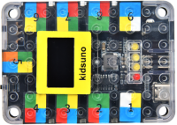|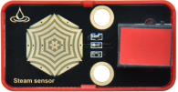|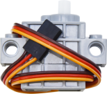|
| :--: | :--: | :--: |
|Kidsuno Mainboard×1|Steam Sensor×1|270°Servo×1|
|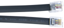|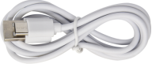| 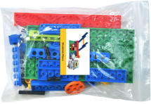 |
|Connection Wire×1|USB Cable×1| Windshield Wipers×1 |

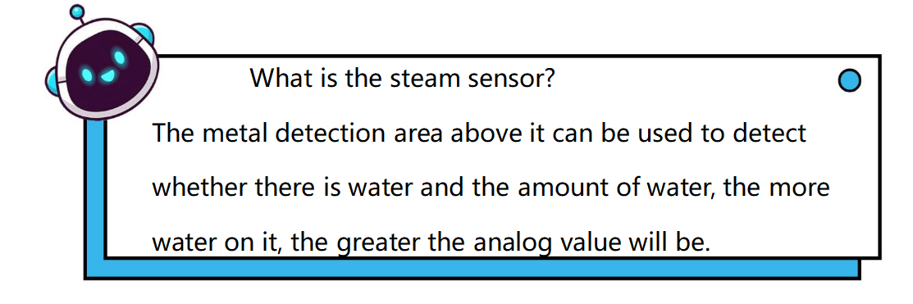

## 3. Installation Steps
Please refer to the following link：https://www.dropbox.com/scl/fo/whacdlki5y44kevau03qa/h?dl=0&rlkey=ogbigsw7lxv8zhkvr1oqhlkmz

## 4. Function: Steam Sensor Detects Water

## 5. Wiring Diagram
Connect the kidsuno mainboard and computer via a USB cable, and connect the servo to the G, V and D13 interface of the mainboard and the steam sensor to the No.7 interface of the mainboard.
The brown wire is connected to G, the red wire is connected to V and the orange wire is connected to D13.
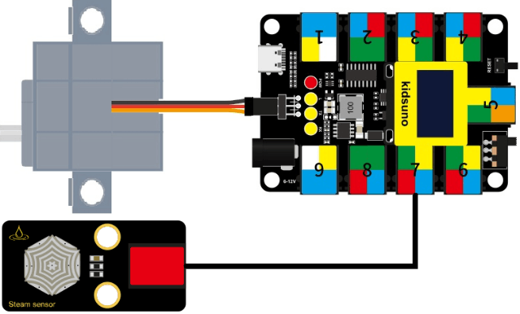

## 6. Write the Program
① Drag the instruction block  in the **Events** module to the script area.

② Drag the instruction block  in the **Serial** module to the script area and take the baud rate 9600 as an example.
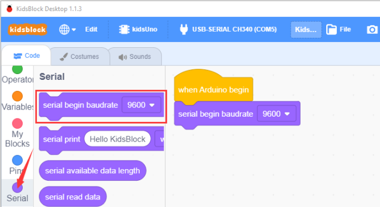

③ Drag the instruction block  in the **Pins** module to the script area. Since the steam sensor is connected to pin A0 of port 7 on the mainboard, then change the number 0 to A0.
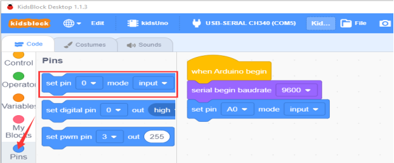

④ Drag the instruction block  in the **Control** module to the script area. 
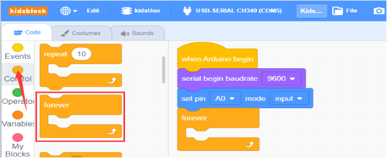

⑤ Drag the instruction block  in the **Serial** module to the script area.
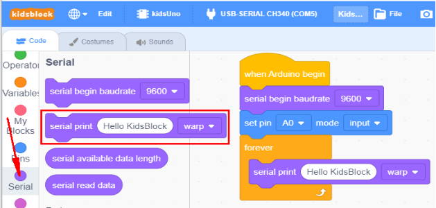

⑥ Drag the instruction block  in the **Pins** module to the script area and put it into the block.
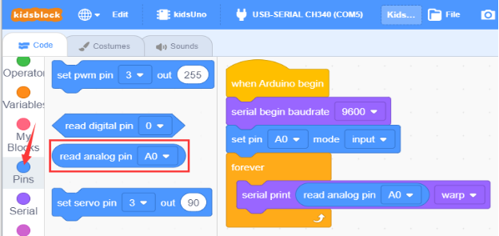

⑦ Drag the instruction block in the **Control** module to the script area and change the number 1 to 0.3.
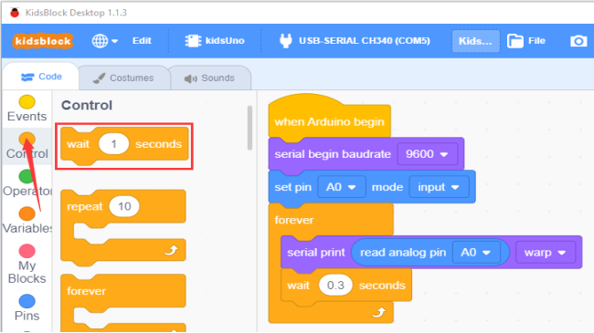

⑧ Complete Program
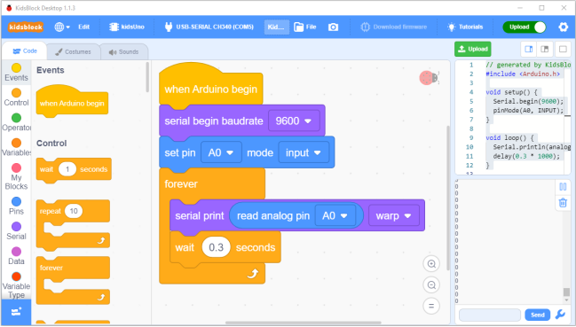

## 7. Test Result
Click  to upload the complete program to the kidsuno mainboard and power up, then click in the serial monitor area to set the baud rate to 9600. When we drip water gradually into the metal detection area of the steam sensor, the analog number will increase gradually.
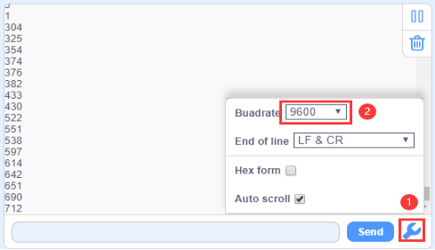

## 8. Function: Steam Sensor Controls the Servo
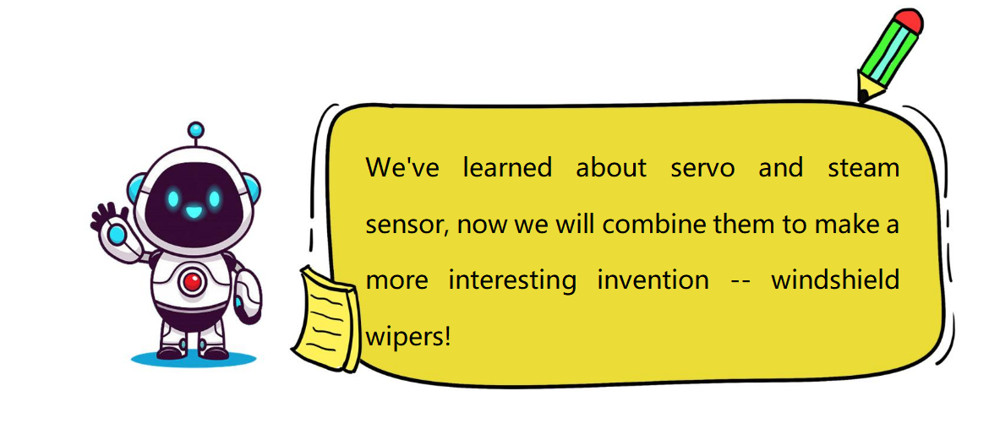

## 9. Flow Chart 
First, set the angle of the servo to 0°. When the analog value of the steam  sensor is greater than 200, the servo will rotate back and forth at 0-100°, otherwise, it will not rotate and the angle of the servo will be 0°.
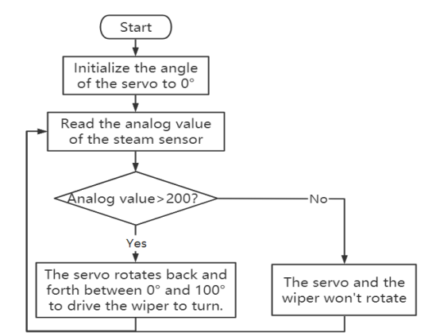

## 10. Add the Servo Instruction Module
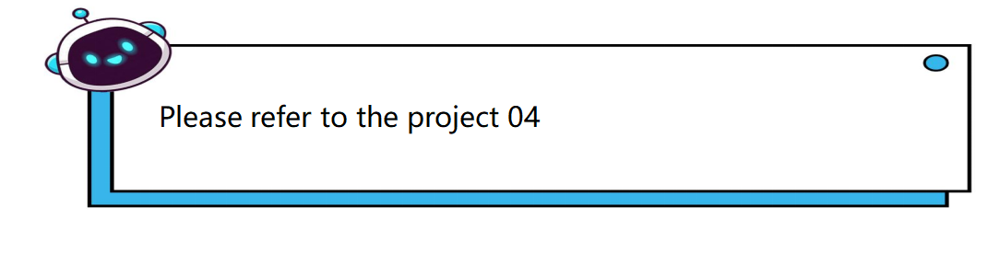

## 11. Description of Building Blocks 
This is the variable module. Let’s look at it! 

There are commonly used **declare global numeric variable type integer name assigned to 0**, **variable** and **Set variable to 0** instruction squares:
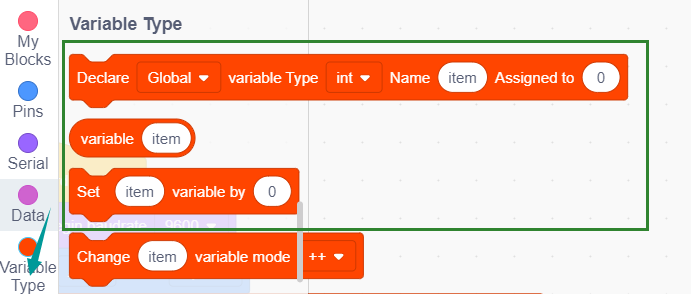

When you need to use this variable, drag the block directly into the script area to edit it!

## 12. Write the Program

① Find the instruction blocks
（1）
    
（2）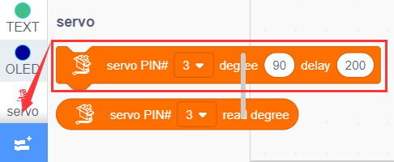
    
（3）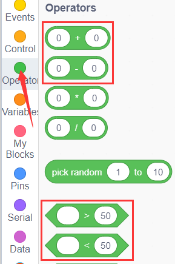
 
（4）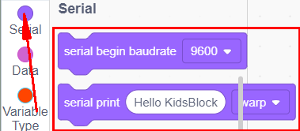
 
（5）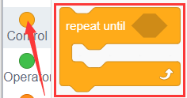
 
（6）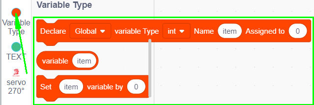
 
（7）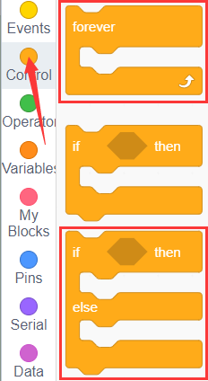
 
（8）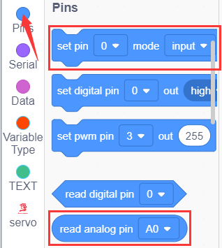
 

② Complete Program
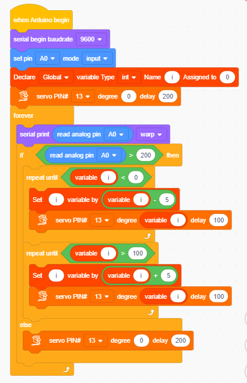

## 13. Test Result
Click to upload the complete program to the kidsuno mainboard and power up. Dripping water gradually into the metal detection area of the steam sensor, if the analog value is greater than 200, the servo will rotate back and forth at 0-100° and the windshield wipers will swing, otherwise, it will not rotate and the wipers will not swing.
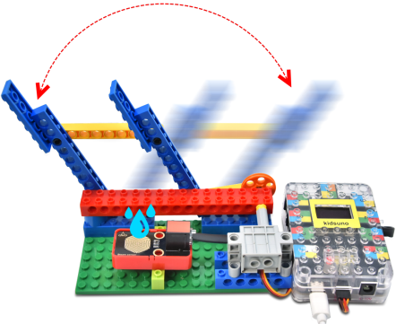

## 14. Extended Project
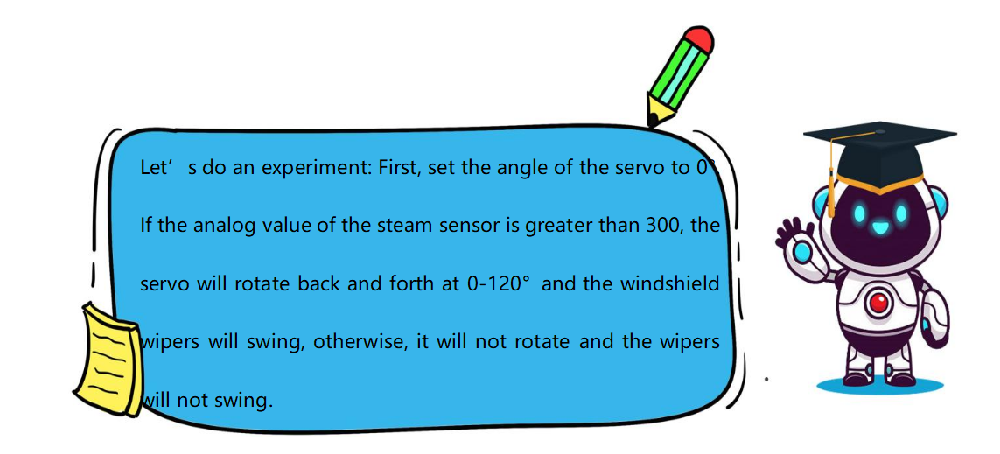

The sample code is below：
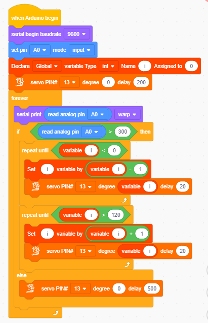

