# Project 08：Intelligent Integrated Traffic System

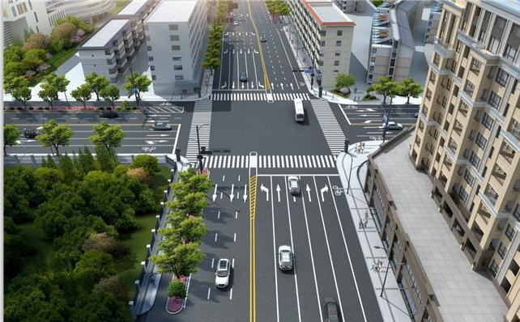

## 1. Introduction
We have learned a host of projects before, can we put them together to make an integrated traffic system？Maybe you can't wait to do it，let’s get started!

The following are the tools we need.

## 2. Components
||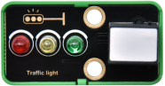|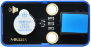|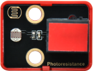|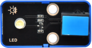|
| :--: | :--: | :--: | :--: |  :--: |
|Kidsuno Mainboard×1|Traffic Light Module×1|Active Buzzer×1|Photoresistor×1|White LED×1|
|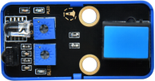|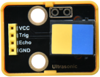|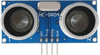|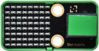||
|Obstacle Avoidance Sensor×1|Ultrasonic Adapter×1|Ultrasonic Sensor×1|8×8 Dot Matrix Display×1|270°Servo×1|
||||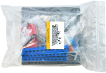 |
|20cm Connection Wire×4|30cm Connection Wire×3|USB Cable×1|Integrated Traffic System×1 |

## 3. Function: Make An Integrated Traffic System

## 4. Installation Steps 
Please refer to the following link：https://www.dropbox.com/scl/fo/whacdlki5y44kevau03qa/h?dl=0&rlkey=ogbigsw7lxv8zhkvr1oqhlkmz

## 5. Wiring Diagram
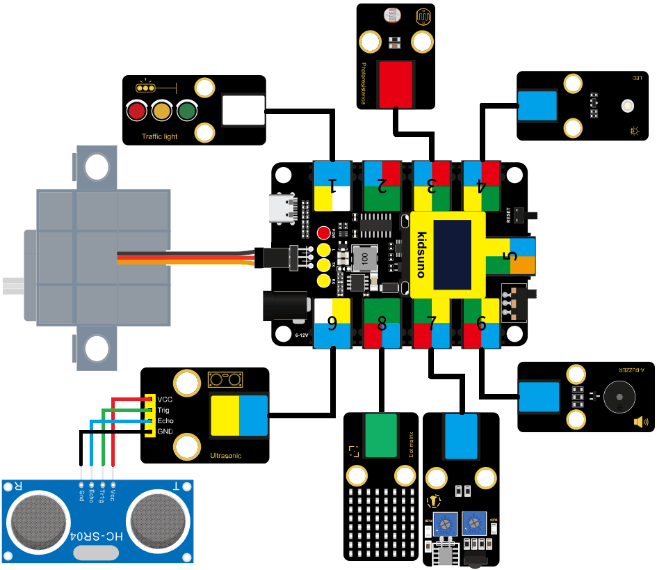
|Module|Kidsuno Mainboard|Module|Kidsuno Mainboard|
| :--: | :--: | :--: | :--: |
|Traffic Lights|Port 1(Red light→D3,Yellow light→D5,Green light→D6)|Active Buzzer|Port 6(D4)|
|Servo|Brown wire→G,Red wire→V,Yellow wire→D13|Obstacle Avoidance Sensor|Port 7(D8)|
|8×8 Dot Matrix|Port(5V, SDA, SCL, GND）|Photoresistor|Port 3(A3)|
|LED Module|Port 4(D2)|Ultrasonic Adapter Board|Port 9(Trig→D10, Echo→D11)|

 

| Ultrasonic Sensor | Ultrasonic Adapter |
| :--: | :--: |
| Vcc | VCC |
| Trig | Trig |
| Echo | Echo |
| Gnd | GND |

## 6. Add the Servo, Ultrasonic Sensor and 8*8 Dot Matrix Instruction Module
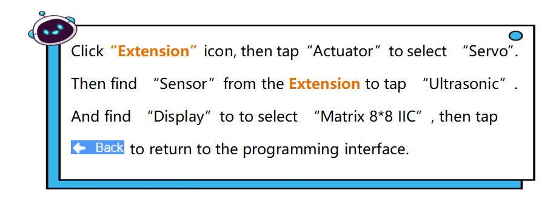
 
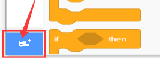
**Extension** Instruction 

 

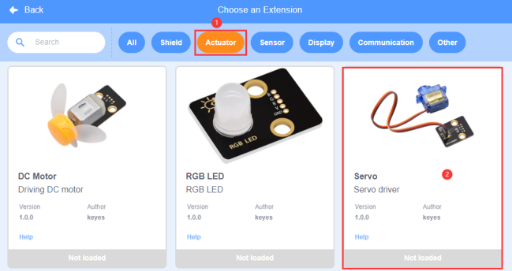
Add **Servo** Module

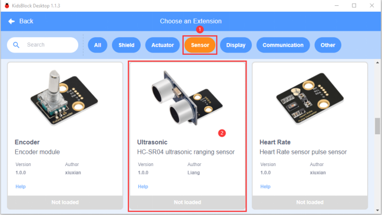
Add **Ultrasonic** Sensor

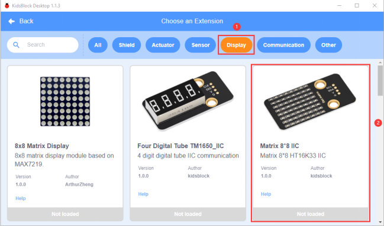
Add **Matrix 8*8 IIC** Display

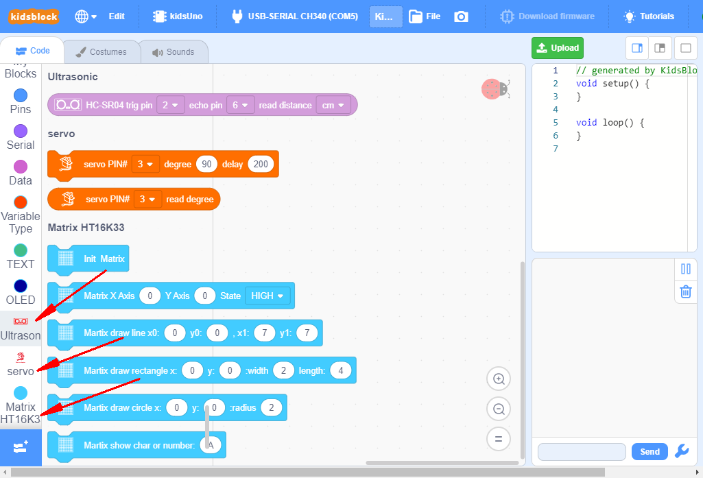

## 7. Flow Chart
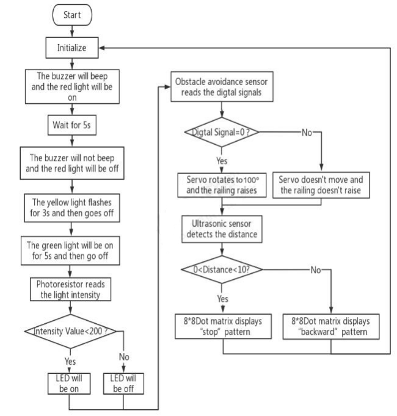

## 8. Write the Program
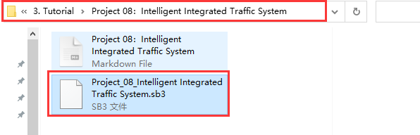

## 9. Test Result
Click to upload the complete program to the kidsuno mainboard and power up. Then the effect of the intelligent integrate traffic system will appear.
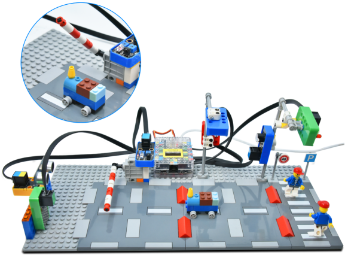

