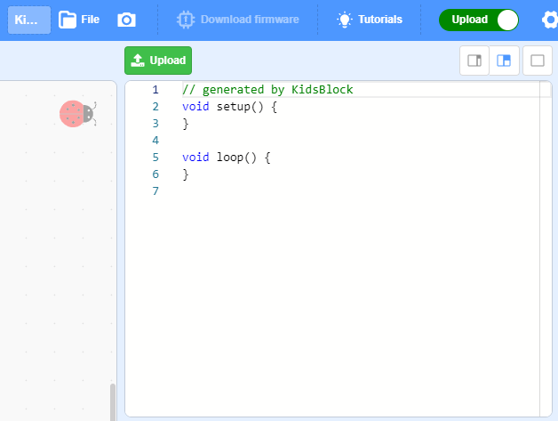

# Upload Mode
Although **Realtime** mode integrates multiple functions, it features disadvantages: Code will not run if the hardware is disconnected to computer. 

Hence, we introduce another mode which burn or save programs permanently in the main control board, and the code can run unless there is a power outage.

This is call **Upload Mode**. 

For instance: Run code to light up LED 2 for 1s and off for 1s, alternatively. 

Firstly we select mainboard and connections (same as Realtime mode), and shift the mode to **Upload Mode**. 

Paste code to it and click **Upload**. 

Congratulations! You have already know how to operate hardware and software! For more functions, please refer to detailed tutorials. During learning, please keep calm and patience, look forward to your success!

