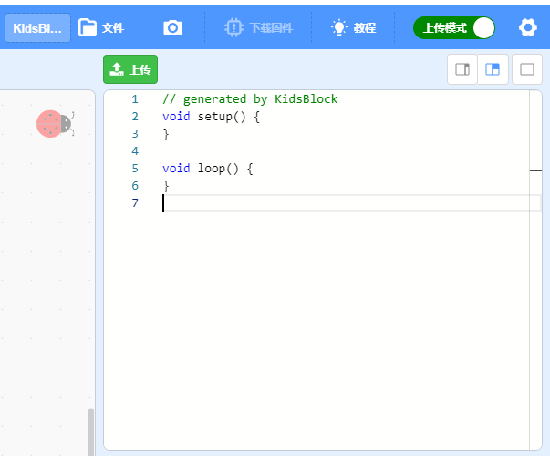

# 上传模式
​如上我们学习了**实时模式**，很便于学习及各种功能的结合，但也有不足，就是当我们的硬件离开电脑后是无法再运行程序的，那么我们就要有一种模式，将程序永久的烧录（保存）在主控板中，保证主控板只要有电时无论在哪里都可以一直运行。
KidsBlock件将程序烧录到主控板的方式叫**上传模式**。
例：上传程序到主板，让2号灯，亮1秒再熄灭1秒，这样永久的循坏工作。
首先我们选择主板及连接方式是跟上面**实时模式**的操作是一样的，区别在于在编程时我们要让模式切换到**上传模式**

接着我们把程序如图编辑好，并点**上传**
**恭喜您！** 到这里你掌握了基本的软件及硬件操作了，更多高级功能及应用，请到其它的教程中学习！请在学习过程中保持冷静，耐心，多问，多找资料，就没有学不会的！加油！

